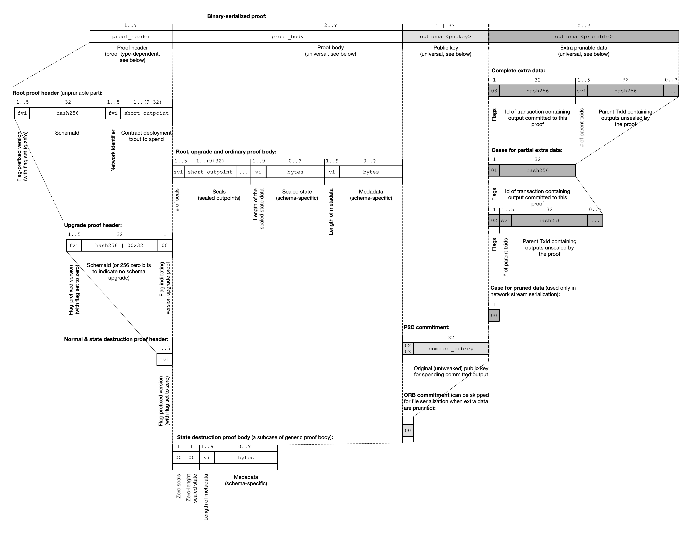

# OpenSeals Framework

* [Overview](#overview)
  * [Definitions](#definitions)
  * [Core concepts and features](#core-concepts-and-features)
  * [Previous work](#previous-work)
* [Protocol details](#protocol-details)
  * [Single use seals](#single-use-seals)
  * [Cryptographic commitments](#cryptographic-commitments)
    * [Deterministic definition of committed output](#deterministic-definition-of-committed-output)
    * [Pay-to-contract commitments](#pay-to-contract)
      * [Public key tweaking procedure](#public-key-tweaking-procedure)
    * [OP_RETURN-based commitments](#op_return-based)
  * [Schemata](#schemata)
  * [Proofs](#proofs)
    * [Proof formats](#proof-formats)
  * [State](#state)
    * [Multi-signature state ownership](#multi-signature-state-ownership)
    * [Proof of state destruction](#proof-of-state-destruction)
  * [Versioning](#versioning)
    * [Commitment and serialization versioning](#commitment-and-serialization-versioning)
    * [Schema version upgrades](#schema-version-upgrades)
* [Consensus serialization](#consensus-serialization)
  * [Data types](#data-types)
    * [FlagVarInt](#flagvarint)
  * [Proof serialization](#proof-serialization)
    * [Header serialization](#header-serialization)
    * [Body serialization](#body-serialization)
      * [Seals serialization](#seals-serialization)
      * [State serialization](#state-serialization)
      * [Metadata serialization](#metadata-serialization)
    * [Original public key serialization](#original-public-key-serialization)
    * [Prunable data serialization](#prunable-data-serialization)
  * [Schema serialization](#schema-serialization)
    * [FieldType](#fieldtype)
    * [StateType](#statetype)
    * [SealType](#sealtype)
    * [ProofType](#prooftype)
* [Test vectors](#test-vectors)
    * [Root proof test vector](#root-proof-test-vector)
    * [Schema test vector](#schema-test-vector)

## Overview

OpenSeals framework allows creation of "dark" (private) state-managing systems and networks, where the **state** is, 
for instance, information on distribution and ownership of some asset; unspent balances or cross-linked immutable data 
structures. The state is shared between selected peers in a trustless manner, maintained in a form of DAG on top of 
Bitcoin blockchain. The framework can also operate on top of different Layer 2 technologies, like Lightning Network, 
Eltoo, etc.

### Definitions

OpenSeals is a framework for a distributed state, where consensus on the state is achieved using combined mechanics of 
**client-side validation** for off-chain data and verification of cryptographic commitments embedded into LNP/BP 
transaction outputs (**single-use seals**). The state is maintained in a form of size-efficient cross-linked **proofs** 
organized as a **directed acyclic graph** (DAG), stored and validated by peers without a need to trust each other.

Proofs are dually-bounded to the Bitcoin blockchain with seals and commitments. Each proof **seals** some **state** to
particular transaction output(s) and uses some (potentially other) transaction output to store its **commitment** to 
the proof itself. The transaction containing output with commitment (**committed output**) must be transaction spending 
at least some of the outputs sealed by the **parent** proof(s).
 
Proof changes the stage by **unsealing** outputs from the **parent** proofs, i.e. by spending assiciated UTXO's with
a transaction containing **deterministically-defined** commitment output.

All the history of the state preceding the state sealed by some proof `A` is called **ancestor proofs** for `A`; they 
form part of global DAG named **ancestry DAG** of `A`. Ancestry DAG represents subgraph of the overall DAG always 
starting at the same root point, named **root proof**, which defines initial **root state**.

Each time a transaction output sealed by some proof is spent (*unsealed*), the proof becomes **historical proof** and
a new proof defining new state must be created and committed to the transaction spending outputs of these 
*parent proofs*. From the point of view of the `X` *historical proof*, the proofs that directly unseals its state are
called **child proofs**, and the whole DAG subgraph composed of all proofs unsealing at least some of the states of
the *child proofs* is named **descending graph**. **Root proof** is an origination point for a **state DAG**, which 
includes all descending proofs of the root proof.


### Core concepts and features

In order to ensure immutability and achieve consensus, it's necessary to strongly bind state changes to Bitcoin 
transaction outputs in a way that makes impossible to modify the state in any other way without invalidating it. 
This is achieved by using cryptographic commitments, i.e. by embedding commitment to the hash of the state change 
(named hereinafter a **proof**) into a Bitcoin transaction output – pretty much like it is done in the 
[OpenTimestamps](https://opentimestamps.org/). This mechanism is called **single-use seals** and was 
[originally proposed](https://petertodd.org/2016/commitments-and-single-use-seals) by Peter Todd. This proposal extends
original concept into a more generic case.

The main distinguishing features of the framework are the following:

* Absence of a shared global state, allowing much higher scalability and a better privacy. You can think of the framework
  as of a DAG or a sharding concept done properly, at the Level 2/3 above LNP/BP, without own blockchain, global state,
  economics distortions caused by token introduction etc.
* Privacy, censorship resistance and permissionlessness: data embedding points into Bitcoin blockchain are completely 
  obscure, allowing censorship resistance in terms of Bitcoin transaction mining and absence of economic incentive 
  distortion for the miners in Bitcoin network, as well as impossibility of data analysis with on-chain analysis.
* Client-side validation and data storage
* Near-zero Bitcoin blockchain pollution
* Security model fully based on the security of Bitcoin network
* Scripting model inheriting Bitcoin scripts
* Support for forthcoming Bitcoin features: Schnorr's signatures, MAST, Taproot etc
* Native support for different Layer 2 technologies

### Previous work

The initial idea for the technology comes from Peter's Todd and Giacomo Zucco concepts and ideas of 
[proof-of-publication](https://lists.linuxfoundation.org/pipermail/bitcoin-dev/2014-December/006982.html)
timestamping ([OpenTimestamps](https://petertodd.org/2016/opentimestamps-announcement)),
[single-use-seals](https://building-on-bitcoin.com/docs/slides/Peter_Todd_BoB_2018.pdf) 
and client-side validation, as was proposed in the original concept for
[Bitcoin-based assets](https://petertodd.org/2017/scalable-single-use-seal-asset-transfer) and 
[RGB protocol](https://github.com/rgb-org/spec/tree/74e9e196129adeae345c7b76c02a89c6814ace2f).


## Protocol details

### Single-use seals

The general principle of single-use seals is the following: the state is defined in a **proof**, which is stored offchain. 
The proof commits to its data immutability by hashing them and embedding the hash into a transaction output of a newly
created and published transaction (either by using **key-tweaking procedure** for some existing output or by creating 
a special `OP_RETURN` output). This transaction output containing the commitment is named **committed output**. 
The proof defines a set of transaction outputs (from zero up to 2^10) which are used as **seals**, meaning that 
the state defined by the associated **sealed data** (also stored the in proof) is valid only, and only until the sealed 
transaction output is not spent; i.e. by this way proof **binds** state to the UTXO set in bitcoin blockchain, and 
cryptographically commit the immutability of the binding by publishing the bitcoin transaction containing the 
commitment.

In order to modify the state bound to some of the seals in UTXOs one needs to (a) spend those UTXOs with a single 
transaction (i.e. this can only be done by the parties controlling this UTXOs, which provides a security model for
managing state changes based on Bitcoin model), (b) create a proof defining the new state and bind it to a new
UTXOs, (c) cryptographically commit to the proof within the same transaction that spends previous sealed UTXOs, 
(d) sign and publish the transaction and wait until it will be mined (mining may be omitted when the technology is
used on Layer 2).

UTXOs to which a state is bound (using proofs) are called **sealed UTXOs**. When the state is modified and the UTXOs
are spent, they become **unsealed txouts** and the proof unsealing them becomes **heading** proof in the DAG composed 
of all historical proofs. Historical proofs (**unsealed proofs**) are linked together through a blockchain-based history 
of unsealed and committed transaction outputs. This history can't be reconstructed without having access to a complete 
history of proofs changing same particular part of the state. Since the proofs are kept by the parties having access to 
the state, the system makes impossible to censor or analyse state changing transactions, their history or reconstruct
the set of state controlling parties (owners).

### Cryptographic commitments

OpenSeals uses two types of on-chain cryptographic commitment to bind the proofs immutability to immutability
properties of bitcoin transactions:
* Pay-to-contract (P2C)
* OP_RETURN-based (ORB) 

P2C commitments SHOULD BE the default type, while ORB SHOULD BE be reserved only for situations where party
producing new proof need to create the transaction with the committed output using hardware wallet without ability
to tweak the public keys with some factor (as described in [Pay-to-contract](#pay-to-contract) section).

The reason of pay-to-contract being the default type is the reduction of Bitcoin blockchain pollution with hash data 
**and** better privacy: pay-to-contract commitments are "transparent" and can't be detected using on-chain analysis.

#### Deterministic definition of committed output

Each state seal must be unsealed only once, when the transaction output binding the state is spent. There also MUST BE 
a single deterministic way of detecting the proof assigned to the sealed state change, so it would not be possible to
create several different versions of the state change proof for the given unsealed output. In order to achieve this,
OpenSeals defines a single way to find which specific transaction output (for the transaction spending sealed outputs)
MUST contain cryptographic commitment with either P2C or ORB commitment schemes. 

The algorithm is designed in a way that helps to keep information of the output containing commitment private from any 
party which may assume that the transaction must contain such commitment. The function combines two parameters: 
* **fee amount** (`fee`): a public factor, which may be changed by the party changing the state (i.e. unsealing an   
  output with a previous state),
* **entropy from previous proof** (`entropy`): a private factor, known only to those who has an access to the history 
  of the proofs. This implies that such factor can't be changed by the party changing the state, since it's predefined 
  at the moment of sealing the parent state.

The committed output number `n` is determined by the following formula:  
`n = (fee * entropy) mod count(outputs)`

The current version of the specification uses RIPMD160 hash of the serialized proof as a source of `entropy`. 
For P2C proofs the proof is serialized _including_ the original public key field (`pubkey`). This different 
serialization and different hash type comparing to SHA256 hash used to create the commitment itself further reduces
probability for some third-party to guess the number of the actual committed output. The root proof, which has no
parent proofs, should take as an entropy value the RIPMD160 hash of the serialized schema type source to which it
commits to.

#### Pay-to-contract

Proof commitment made with pay-to-contract (P2C) type SHOULD BE considered valid if, and only if:

1. The `n`th output defined by the [deterministic committed output](#deterministic-definition-of-committed-output) 
   pays an arbitrary amount of satoshis to `P2PKH`, `P2WPKH` or `P2SH`-wrapped `P2WPKH`.
2. The public key of this output is tweaked using the method described below

Otherwise, the proof MUST BE considered as an invalid and MUST NOT BE accepted; the state associated with the unsealed 
proofs MUST BE considered as lost (destroyed). 

Rationale for not supporting other types of transaction outputs for the proof commitments:
* `P2PK`: considered legacy and MUST NOT be used;
* `P2WSH`: the present version of RGB specification does not provides a way to deterministically define which of the 
   public keys are present inside the script and which are used for the commitment – however, this behaviour may change 
   in the future (see the note above);
* `P2SH`, except `P2SH`-wrapped `P2WPKH`, but not `P2SH`-wrapped `P2WSH`: the same reason as for `P2WSH`;
* `OP_RETURN` outputs can't be tweaked, since they do not contain a public key and serve pre-defined purposes only. 
   If it is necessary to commit to OP_RETURN output one should instead use [OP_RETURN commitments](#op_return-based)
*  Non-standard outputs: tweak procedure can't be standardized.

NB: since in the future (with the introduction of the future SegWit versions, like Taproot, MAST etc) the list of 
supported output types MAY change, state bound to an invalid output types MUST NOT BE considered as deterministically 
**destroyed**, but rather as **undefined**. In order to create a proper proof of state destruction a user MUST follow 
the procedure described in the [Proof of state destruction](#proof-of-state-destruction) section.

##### Public key tweaking procedure

The tweaking procedure has been previously described in many publications, such as 
[Eternity Wall's "sign-to-contract" article](https://blog.eternitywall.com/2018/04/13/sign-to-contract/).
However, since the tweaking is already widely used practice 
([OpenTimeStamps](https://petertodd.org/2016/opentimestamps-announcement), 
[merchant payments](https://arxiv.org/abs/1212.3257)) and will be even more adopted with the introduction of 
[Taproot](https://lists.linuxfoundation.org/pipermail/bitcoin-dev/2018-January/015614.html), 
[Graphroot](https://lists.linuxfoundation.org/pipermail/bitcoin-dev/2018-February/015700.html), 
[MAST](https://github.com/bitcoin/bips/blob/master/bip-0114.mediawiki) and many other proposals, the hash, used for 
public key tweaking under one standard (like this one) can be provided to some uninformed third-party as a commitment 
under the other standard (like Taproot), and there is non-zero chance of a collision, when serialized proof will present 
at least a partially-valid Bitcoin script or other code that can be interpreted as a custom non-OpenSeals data 
and used to attack that third-party. In order to reduce the risk, we follow the practice introduced in the 
[Taproot BIP proposal](https://github.com/sipa/bips/blob/bip-schnorr/bip-taproot.mediawiki#tagged-hashes) of prefixing 
the proof hash with *two* hashes of OpenSeals-specific tags, namely "openseal". Two hashes are required to 
further reduce risk of undesirable collisions, since nowhere in the Bitcoin protocol the input of SHA256 starts with 
two (non-double) SHA256 hashes <https://github.com/sipa/bips/blob/bip-schnorr/bip-taproot.mediawiki#tagged-hashes>.

The whole algorithm thus looks in the following way:
1. Serialize proof with a procedure described in the [Proof serialization](#proof-serialization) section
2. Compute SHA256 hash of the serialized data, which is also will serve as a unique identifier for the proof: 
   `id = SHA256(serialized_proof)`
1. Get result of `hash(message, tag) := SHA256(SHA256(tag) || SHA256(tag) || message)` function
   (see [Taproot BIP](https://github.com/sipa/bips/blob/bip-schnorr/bip-taproot.mediawiki#tagged-hashes) for the details),
   where `message` MUST contain concatenated original public key `original_pubkey` and proof's `id`:
   `h = hash(original_pubkey || id, 'openseal')`
2. Compute `new_pubkey = original_pubkey + h * G`
3. Compute the address as a standard Bitcoin `P2(W)PKH` using `new_pubkey` as public key

In order to be able to spend the output later, the same procedure should be applied to the private key.

#### OP_RETURN-based

This type MUST BE used only to commit the proofs created with a special hardware (digital wallets) which is unable to
support modification of output public keys.

A transaction committed to a proof using ORB type is considered valid if:

1. The `n`th output defined by the [deterministic committed output](#deterministic-definition-of-committed-output) 
   pays an arbitrary amount of satoshis to `OP_RETURN` output
2. This output contains a 32-bytes push which is SHA256 of the entity which the transaction is committing to 
   (i.e. double SHA256 of serialized proof data, like in P2C commitments), prefixed with 'openseal' tag: 
   `OP_RETURN <SHA256('openseal' || SHA256(SHA256(serialized_proof)))>`


### Proofs

Proof consists of data that are cryptographically committed, i.e. must be preserved as immutable – and extra data,
which always may be deterministically re-computed basing on the data from the Bitcoin blockchain transactions and other
proofs. Such extra data represent a prunable part of the proof, which may be discarded. 

* Immutable data:
  - `header`: data which differ between different proof formats (see below)
  - `body`: data which have the same structure for all proof formats:
    * `seals`: UTXOs which are assigned some state by this proof
    * `state`: actual state data sealed to the UTXOs
    * `metadata`: a list of fields with special information, which has to be maintained immutable, but not sealed
  - `pubkey`: original (non-tweaked) public key; the field is present only in [P2C-commited proofs](#pay-to-contract).
     Pubkey is not a part of the proof hash/id, however proofs are cryptographically committing to it within the actual
     P2C commitment (see [Public key tweaking procedure](#public-key-tweaking-procedure))
* Prunable data:
  - `txid`: a transaction id containing output committed to this proof
  - `parents`: *parent* transaction ids containing outputs unsealed by the proof

The reason why it may be reasonable to keep and transfer extra data is a performance: reconstruction of these data will 
require significant computing/multiple  DB queries, and it will be much easier to check their correctness having the 
data themselves than to re-compute them from scratch.

#### Proof formats

There are four main types of the proofs: 
* **Root proof**, which define the source for the state history, i.e. they represent DAG root node. Root proof contain 
  special fields in their `header`: 
  * `ver`, specifying the OpenSeals framework version used for proof serialization, interpretation and verification.
  * `schema`: a double SHA256-hash of the schema name (for informally-defined schemas) or double SHA256-hash of 
    serialized formal schema definition data (see [Schemata section](#schemata) for more details)
  * `network`: Bitcoin network in use. Currently the system supports the following networks:
    - Bitcoin mainnet: 0x01
    - Bitcoin testnet: 0x02
    - Bitcoin regtest: 0x03
    - Bitcoin signet: 0x04
    - Liquid v1: 0x10
  * `root`, pointing to transaction output which MUST be spent and become one of the inputs for the transaction 
    containing an output committed to the root proof. This mechanism is necessary to prevent possible double-publication
    of the root proof and ambiguity in the state.
* **Version upgrade proofs**, that signal OpenSeals version upgrade according to the
  [version upgrade procedure](#versioning). These proofs has the following additional fields:
  * `ver`, specifying a new OpenSeals framework version used for proof serialization, interpretation and verification. 
  * `schema`: a double SHA256-hash of the updated schema name (for informally-defined schemas) or double 
    SHA256-hash of serialized formal schema definition data. If the proof does not assign a new schema, this field must 
    be set to 256 zero bits.
* **Ordinary proofs**, which may have an optional version field (see [Schema version upgrade](#schema-version-upgrades) 
  below).
* **[Proof of state destruction](#proof-of-state-destruction)** is a special form of an ordinary proof with zero 
  number of seals and empty sealed state.

### State

Publication of the transaction containing committed output to a root proof creates a root for the decentralized state,
changes to which will be maintained in a form of a DAG, consisting of other proofs spending sealed transaction 
outputs from the root proof.

A distributed state is initialized by a root proof can be uniquely identified with the root proof id, i.e. its hash
used for the commitment procedure. This hash includes the hash of the transaction output which is spent during the
proof publication (`root` field), so there is no way to publish the same proof twice and have the same id for some 
distributed state.

#### Multi-signature state ownership

Multi-signature state ownership is working in the same way it works for bitcoin: proofs MAY assign parts of the state 
to a `P2SH` or `P2WSH` address containing multi-signature locking script, while being committed with either P2C or ORB 
commitment to some other output within the same or other transaction.

Such state can be changed with a new proof only under the same circumstances as satoshis under this output: if the 
unlocking script will satisfy the signing conditions of the locking script.

#### Proof of state destruction

Token owners have the ability to provably and deterministically destroy parts of the state. To do this, proof owner 
having control on some parts of the state has to create a special form of the proof (**proof of state destruction**),
which is an ordinary proof with zero seals and empty state data, and commit it with either P2C or ORB commitment. 
The proof MAY then be published in order to prove that the part of the state was really destroyed.


### Schemata

The schema in OpenSeals defines the exact structure of a seal-bound state, including:
* relation between seals pointing to transaction outputs and parts of the state;
* structure for state data and metadata fields;
* serialization and deserialization rules for state data and metadata (see [Proof serialization](#proof-serialization) 
  section)
* rules to validate the state and state changes, which are additional to the validation rules used by OpenSeals 
  framework

The schema can be defined in formal or an informal way. One of OpenSeals schema samples is an 
[RGB protocol](04-RGB.md), defining RGB schema for digital assets (digitalized securities, collectibles etc) issuing 
and transfer.

Schemata are identified by a cryptographic SHA256-hash of the schema name (for informally-defined schemas) or 
double SHA256-hash of serialized formal schema definition data (see [Schema serialization](#schema-serialization) 
section). OpenSeals-enabled user agents MAY use the hash to locate and download schema formal definition file (QSD) and 
use it in order to parse the sealed state and validate parts of it in relation to schema-defined state validation rules.


### Versioning

Iin order to allow future enhancements to the used commitment protocols and proof validation OpenSeals framework
supports **versioning**.

Versioning defines:
* which cryptographic commitments are allowed and how the proofs have to be validated regarding the commitment rules;
* proof and schema binary serialization format (called **consensus serialization**) for network transfer and on-disk
  storage;
* which schema version is used by the proofs.

#### Commitment and serialization versioning

The first two parts are defined using generic versioning field, present in *root* and *version upgrade proofs*.

The version used by other proofs is defined by the [root proof](#proof-formats), and *state DAG* MUST by 
default follow the version provided by the *root proof*. However, it is possible to update the version using special 
[**version upgrade proof**](#proof-formats), signifying that all *descendant proofs* of it must follow 
the new updated OpenSeal version.

A special attention must be paid to such version upgrades. These updates, in order to address the associated risk of
"double-spent attack" (or, multiple conflicting state changes), MUST follow very specific procedure:
1. An on-chain committed valid *version upgrade proof* defines a new version for all descending proofs **except** itself.
   This proof MUST use and MUST BE validated with the commitment scheme rules from the *previous* version.
3. All the descending proofs unsealing at least some of the seals defined by the *version upgrade proof* adapting a new
   version MUST adapt and MUST BE validated with the new commitment scheme as defined by the new version specification.
4. All outputs unsealed by a proof MUST have the same version for the associated parent proofs.
5. There is no possibility to downgrade the version of the proofs that has adopted a commitment scheme upgrade.

Creators of the *state DAG* (i.e. publishers of the *root proof*) MAY specify additional rules for version upgrade
mechanics, like presence of specially-designed normal proof signaling their support for the version upgrade (see, for
example, version upgrades in the [RGB protocol](./04-RGB.md)).

#### Schema version upgrades

The third form of versioning allows modification of the proof `meta`, `state` and `seals` format with migration to a 
newer schema version. This upgrade is performed also using *version upgrade proofs* with non-zero *schema* field
(see [proof serialization formats](#proof-formats) for more information). Unlikely commitment serialization
a schema upgrade is applied to the *version upgrade proof* as well as to all of its descendants.


## Consensus serialization

The following chapters explain the exact data structure and serialization format for different entities which constitute
parts of OpenSeals framework. Like with bitcoin serialization format for transactions and block data, proofs and schema
serialization rules MUST BE strictly followed by all software working with OpenSeals as a requirement for the whole
P2P network to have the same view on a given proof history data. Thus, serialization format defined in this section is
named "consensus serialization", and it's deterministic property allows to compute *proof ids* and *schema ids* in a 
consistent way, matching values stored with in cryptographic commitments into the bitcoin blockchain.

### Data types

Proof state and metadata fields, as well as many parts of schema, utilize standard serialization primitive types. This
primitives generally follows bitcoin serialization rules, and are named hereinafter in the following way:
* 8- to 64-bit signed and unsigned integer (`u8, u16, u32, u64, i8, i16, i32, i64`)
* Variable-length unsigned integer (`vi`)
* `sha256`, double SHA256 (`sha256d`), `ripmd160`, RIPMD160 after SHA256 (`hash160`) hash types
* `pubkey`, in compressed format

Also, proofs use standard composed types from bitcoin consensus serialization:
* `str`: first byte encodes string length, the rest — the actual string content. Zero-length strings equals to NULL
  if the optional value is implied.
* Variable-length byte string, consisting of `vi` followed by byte sequence of the corresponding length
* `OutPoint`, consisting of a transaction id (`sha256d`) followed by `vout` number (in form of `vi`)

Additionally to bitcoin-defined types, OpenSeals defines new primitive types, created with the aim to reduce the size
of off-chain client-side stored data. These types are:
* Flag-prefixed variable-length unsigned integer, `fvi`, which extends VarInt with special single-bit flag, preserving a
  byte where the flag is required and followed by VarInt-length data.
* Short from of transaction output, which starts with `vout`, stored in the form of  `fvi`, which may be optionally 
  followed by full transaction id (if `vout` has a flag set to `1`). This format allows to store short forms of output
  which reference the same transaction used for storing the commitment to the proof.

#### FlagVarInt

`fvi` uses Bitcoin VarInt-like serialization format, but it reserves the highest bit from the first byte for a flag
and supports values only up to 32-bit integers. In general, it helps to save a byte on signaling some information inside
the proofs and seals.

Since fvi is used with the data that are less than 2^23 (like transaction output numbers, `vouts`, or number of seals
within a single proof), values of `0x7F` and `0xFF` in the first byte has a special meaning: instead of representing
following 64-bit integer (like `0xFF` first byte does in bitcoin variable integer), it is reserved to function as a 
"flagged data separator": it is not followed by any integer value and has contextual meaning which can be used depending
on the protocol.

```
<124      -> _ * * *   * * * * : 
124-255   -> _ 1 1 1   1 1 0 0 : * * * *   * * * *
256-2^16  -> _ 1 1 1   1 1 0 1 : * * * *   * * * * : * * * *   * * * *
2^16-2^32 -> _ 1 1 1   1 1 1 0 : * * * *   * * * * : * * * *   * * * * : * * * *   * * * * : * * * *   * * * *
separator -> _ 1 1 1   1 1 1 1
```

(* is a wildcard for bytes that can have any value, i.e. used to encode the actual integer).

Sample deserialization code:

```rust
fn parse_flagvarint() -> (u32, bool) {
    let flag_firstbyte : u8 = read_byte();
    let flag = flag_firstbyte.clone() & 0x80;
    let firstbyte = flag_firstbyte - flag;
    let value = match firstbyte {
      124 => read_byte(),                    // ... read and shift next byte
      125 => (read_byte() as u32)
             + ((read_byte() as u32) << 8),  // ... read and shift next 2 bytes
      126 => (read_byte() as u32)
             + ((read_byte() as u32) << 8) 
             + ((read_byte() as u32) << 16), // ... read and shift next 3 bytes
      127 => (read_byte() as u32)
             + ((read_byte() as u32) << 8) 
             + ((read_byte() as u32) << 16) 
             + ((read_byte() as u32) << 24), // ... read and shift next 4 bytes
      _ => firstbyte,
    };
    return (value, flag == 0x80);
}
```


### Proof serialization

All proof formats are serialized with the same rules and in a way that enables reading and verifying proof seals and
commitments without knowing anything about the format for the proof state and metadata (i.e. without knowledge of
the schema). Serialization format is highly optimized for the size of resulting data.

The same serialization format applies both to on-disk stored data and network-transferred data.

Serialized proof consists of four main parts:
* `proof_header`, which is specific to the [proof format](#proof-formats),
* `proof_body`, which has the same structure for all proof formats,
* `pubkey_structure`, which is an optional field present only in [P2C-committed proofs](#pay-to-contract)
* `prunable_data`: data that can be discarded on disk or during network transfers; for more information on them check 
  the [Proofs](#proofs) section)

Binary bytecode of `proof_header` followed `proof_body` represents a source message for a double SHA256, which is used
as a proof identification hash (`proof_id`) in creating [cryptographic commitments](#cryptographic-commitments) to 
bitcoin blockchain. `pubkey` is not a part of the `proof_id`, but it is used in the construction of 
[P2C commitment](#public-key-tweaking-procedure).



#### Header serialization

Proof format is determined from the header data by using two flags, stored within [FlagVarInt](#flagvarint) values,
encoding version and network number. If the first flag in the version field (first byte of the proof data) is set to
`1`, than the proof is either of *root* or *upgrade* format and the version field MUST BE followed by 32 little-endian
bytes of the `schema_id` field and another FlagVarInt value representing `network`. The flag in this value determines
if the proof is a *root proof* (flag is set) or *upgrade proof* (flag is unset). Since version upgrade proofs can't
redefine the type of the network, the value of the `network` field for them MUST be always set to zero (i.e. no network
version change, since network type numbers start with `0x01`). Also, *upgrade proofs* may not specify new `schema_id`;
in this case corresponding field MUST BE filled with 32 zero bytes. For *root proofs*, `network` field MUST BE followed
by `root` field encoded in the standard bitcoin serialization format for transaction `OutPoint` (32 bytes for `txid`
followed by `VarInt`-encoded output number).

If the flag in the first `ver` byte is set to zero, proof format is an *ordinary proof* or *state destruction proof*, 
which can differentiated using the [number of the seals](#seals-serialization) in the [proof body](#body-serialization).

Header parsing algorithm summary:
```python
proof = Proof()
fver = read_fvi() # function for reading FlagVarInt bytes with return value having two fields: `value` and `flag`
proof.ver = fver.value
if ver.flag is True:
    schema_id = read_bytes(32)
    fnetwork = read_fvi()
    if fnetwork.flag is True:
        proof.network = fnetwork.value
        proof.format = ProofFormat.root
        proof.schema_id = schema_id
        if schema_id eq bytes([0] * 32):
            raise ProofStructureError(ProofStructureError.noSchemaInRootProof)
        proof.outpoint = read_outpoint(allow_zero = False)
    else:
        if fnetwork.value is not 0:
            raise ProofStructureError(ProofStructureError.networkChangeInUpgradeProof)
        proof.format = ProofFormat.upgrade
else:
    proof.format = ProofFormat.ordinary
    # read body (see below)
    try:
        fseals = read_fvi() # function reading FlagVarInt value must handle special byte values 0xFF and 0x7F
                            # here we do this via exceptions
    except FlagVarIntSeparatorFFByte:
        proof.format = ProofFormat.state_destruction
```

#### Body serialization

Within the proof body there are three parts with very specific structure, required for the dense data encoding:
`seal_sequence`, `sealed_state` and `metadata`. The encoding of these data also organized in a way that allows to
read stream and parse files from the disk without knowledge of the particular seal types, state and metadata structure
(i.e. [schema](#schema-serialization)). Below we provide details on their encoding format.

Proof body starts with a single byte representing [proof_type](#prooftype) from corresponding [schema](#schemata).
If the schema is unknown to the client, it may skip this byte. Proof type (together with schema data) defines an
exact way how sealed state and metadata can be parsed; without it a client can only read them as a sequence of bytes
having known length (see below).

Starting from the second byte of the proof body `seal_sequence` starts. It has no predefined length, but by following
special parsing algorithm a software can deterministically read all seals data.

##### Seals serialization

`seal_sequence` is serialized in a form of consecutive transaction outpoints in a short form, `soutpoint` (see details 
in the [data types section](#data-types)) optionally separated by special separating byte with value `0x7F`. The 
sequence is terminated with `0xFF` byte. Since each short OutPoint starts with [FlagVarInt](#flagvarint) value, 
representing `vout` number of the sealed transaction output, and FlagVarInt has `0x7F` and `0xFF` values reserved as a
special separator bytes, a deserializer can easily parse whole `seal_sequence` up to the terminating `0xFF` byte:

```python
seals = []
seal_type_no = 0
while True:
    try:
        fvout = read_fvi()
    except FlagVarIntSeparator7FByte: # 0x7F value is met
        seal_type_no += 1
    except FlagVarIntSeparatorFFByte: # 0xFF value is met
        break
    if fvout.flag is True:
        txid = read_bytes(32)
    else:
        txid = None
    seals.append((fvout.value, txid, seal_type_no))
```

The separating byte is required to distinguish seals of different [`seal_type`](#sealtype) value. If a client
software is unaware of the proof schema, it can simply ignore this separating bytes – and still be able to verify
the proof integrity and which of the seals are unsealed with transaction spending associated outpoints.

If the schema is known, `0x7F` separating byte is used to increment *seal type counter* (like `seal_type_no` from the 
sample script above), and associate each of the read seals with specific seal type from the schema: this number
corresponds to the seal type with the same index number withing schema data.

Both `unseals` and `seals` must be serialised separately, in that order, so that the seal type for each unseal may be distinguished independently from each seal. In the case of root proofs, where no unseals are present, a single `0xFF` byte should be encoded, which terminates the decoder, returning an empty array.

##### State serialization

State is serialized in form of variable-length byte array starting with `VarInt` length value. State can be only parsed
when the schema is known.

In order to parse the state, a client must iterate over the seal data and read from the state byte sequence according
to the [`seal_type`](#sealtype) data format.

##### Metadata serialization

Metadata serialized in a similar way to the state, however, unlike the state, which has 1-to-1 correspondence to the 
seals, each proof may have different number of its metadata fields (see [FieldType](#fieldtype) description for the
details). 

Briefly, schema defines which types of metadata fields can be present in the corresponding proof type (defined by
the `proof_type` field in the first byte of the proof body data), and how many occurrences of the field are allowed.
Lower and upper bounds for the number of occurrences can form the following variants:
* **optional field**, which can be present from 0 to at most one time;
* **single field**, which can be present exactly one time;
* **fixed field**, for which the lower bound is equial to the upper bound, signifying that it can be present only
  exactly defined number of times
* **multiple field**, which is always present and can be present zero, single or multiple number of times

These types are serialized in the following way:

Occurrence type | Lower limit | Upper limit | Serialization format  | Comments
--------------- | -----------:| -----------:| --------------------- | --------
single          | 1           | 1           | `<field_data>`        | Single field data
fixed           | N           | N           | `<field_data>{n}`     | Multiple field data
optional        | 0           | 1           | `<type_specific>  `   | Depends on the field data type (see the table below)
multiple        | 0 or 1      | 0xFF (=any) | `vi,<field_data>{vi}` | Number of the actual occurrences followed by a list of field data

where `<field_data>` is a serialization format for the [data type](#data-types) used by the metadata field (as defined
in the `field_types` section of the [schema](#schema-serialization)).

Optional occurrence type is encoded depending on the type of the field data:

Data type   | Encoding          | Value for no data | Details
----------- | ----------------- | ----------------- | -----------
`str`       | `vi,<string>`     | `0x00`            | Zero-length string means *no value*
`fvi`       | `fvi`             | `0xFF`            | `0xFF` separator byte for [FlagVarInt](#FlagVarInt) means *no value*
Hashes      | `0x00{n}`         | `0x00` x hash len | If hash is represented by zero bytes, the field has *no value*
`soutpoint` | `fvi,byte{32}`    | `0xFF`            | `0xFF` separator byte for [FlagVarInt](#FlagVarInt) representing vout for the transaction output means *no value*
`pubkey`    | `flag,[byte{32}]` | `0x00`            | Pubkey is encoded in the compressed format, so it always start with `0x02` or `0x03` byte. Thus, it starts with `0x00` byte than no public key is provided

The rest of data types can't be an optional value, and a schema defining field to have a field type with 0 to 1 value
with some other data type is invalid.

#### Original public key serialization

Proof [commitment type](#cryptographic-commitments) (P2C or ORB) is defined by the presense of public key data following
proof body data sequence. If the next byte after proof body equals `0x00`, it means that no original public key is
provided and the proof is committed with [OP_RETURN-based commitment](#op_return-based) – and, if corresponding 
transaction does not have OP_RETURN script at the 
[deterministically-defined output](#deterministic-definition-of-committed-output) than the whole proof is invalid.

Pubkey data are encoded in the compressed format, so it always start with `0x02` or `0x03` byte. Thus, if the first
byte following proof body equals `0x00`, proof is committed with OP_RETURN.

### Prunable data serialization

The last part of the proof is optional prunable data. These data may be completely absent in case of disk-stored proof
files, so EOF following public key data will mean pruned proof. However, for network transfers, we can't define end of
proof stream, so in order to specify the absence of the prunable proof part, a proof MUST BE terminated with an extra 
`0x00` byte.

If the first byte following public key data is non-zero, than it is used as a flag byte signifying which of the prunable
data are present (see [Proofs section](#proofs) for more details on the prunable data):

Binary mask  | Hex value | Data
------------:| --------- | ------------
 `0000 0001` | `0x01`    | Transaction id containing an output with proof commitment is present (`txid` field)
 `0000 0010` | `0x02`    | List of *parent* transaction ids is present
 
If binary mask of the first byte indicates presence of multiple prunable data, they are ordered in lowest to highest
bit order of the first flag byte.


### Schema serialization

Schema file uniquely defines which kinds of proofs can be used for the given schema; how they can be constructed into
a DAG via different seals and which kinds of state and metadata they have to provide. First, schema defines all possible
data types for metadata fields, state and seals; than it lists definitions for proof types (not to be mixed with
[Proof formats](#proof-formats)), which are composed of different combinations of seals and metadata.

Field         | Serialization format    | Description
------------- | ----------------------- | -----------------------
`name`        | `str`                   | Schema name (human-readable string)
`schema_ver`  | `vi`, `u8`, `u8`        | Schema version in [semantic versioning format](https://semver.org/)
`prev_schema` | `sha256d`               | Previous schema version reference or 256 zero-bits for the first schema definition
`field_types` | `vi[`[`FieldType`](#fieldtype)`]`| Definition of all possible fields with their corresponding data types that can be used in the `meta` section of the proos
`seal_types`  | `vi[`[`SealType`](#sealtype)`]`  | Definition of different seal types and corresponding state types that can be used by the proofs 
`proof_types` | `vi[`[`ProofType`](#prooftype)`]`| List of possible proof formats, bridging meta fields and seal types together with their validation rules


#### FieldType

Metadata are composed of field types. Each metafield type is encoded as a tuple of `(title: str, type: u8)`, 
where title string is bitcoin-encoded string. Values for each types are given in the following table:

Type Id    | Value identifying type | Description | Size | Serialization
---------- | ---- | ----------------------------- | ---- | -----
u8         | 0x01 | Unsigned 8-bit integer        | 1    | byte 
u16        | 0x02 | Unsigned 16-bit integer       | 2    | two bytes (word)
u32        | 0x03 | Unsigned 32-bit integer       | 4    | four bytes (double word)
u64        | 0x04 | Unsigned 64-bit integer       | 8    | eight bytes (quadruple word)
i8         | 0x05 | Signed 8-bit integer          | 1    | byte 
i16        | 0x06 | Signed 16-bit integer         | 2    | two bytes (word)
i32        | 0x07 | Signed 32-bit integer         | 4    | four bytes (double word)
i64        | 0x08 | Signed 64-bit integer         | 8    | eight bytes (quadruple word)
vi         | 0x09 | Variable-length unsigned integer | 1-9 | 
fvi        | 0x0a | Flagged variable-length unsigned integer | 1-5 | 
str        | 0x0b | String                        | vi+n | vi(length)+bytes
bytes      | 0x0c | Byte string                   | vi+n | vi(length)+bytes
sha256     | 0x10 | Single SHA256 hash            | 32   |
sha256d    | 0x11 | Double SHA256 hash            | 32   |
ripmd160   | 0x12 | Single RIPMD160 hash          | 20   |
hash160    | 0x13 | SHA256 hash followed by RIPMD160 | 20 |
outpoint   | 0x20 | Transaction output            | 33-41 | `sha256d, vi`
soutpoint  | 0x21 | Short transaction output      | 1-37 | `vi, [sha256d]`
pubkey     | 0x30 | Public key in compact format  | 33   | 
ecdsa      | 0x31 | ECDSA signature               | 72   | `DER`

#### StateType

State sealed and updated by the proofs can be of the following kinds:

* **State without a value**: this type of state may help to track proofs of some binary actions taken by owners, like 
  the proofs for the fact of asset reissuance.
* **Unspent balances**, as fractions of total value, useful as a unit of accounting. The state is stored as u64 values,
  like bitcoin satoshis, representing the minimum indivisible part of some asset. The total asset supply in this case
  MUST BE defined as one of the meta fields.
* **Array of immutable data** or **datagraph**: Data are appended to some immutable graph with each new proof
* **Mutable complex single value**: TBD
* **Distributed value components**: TBD

Each state type is encoded as a tuple of `(title: str, type: u8)`, where title string is bitcoin-encoded string.
Values for each types are given in the following table:

State Type | TypeId  | Data member name
---------- | ------- | -----------------
No value   | 0x00    | -
Balances   | 0x01    | `amount`
Datagraph  | 0x02    | `data`


#### SealType

Since proofs can manage multiple kinds of the state at the same time, it's important to define which seals will be able
to manage which types. This is done through `SealType` data structure, consisting of tuples 
`(title: str, state_type_idx: u8`), where `state_type_idx` is the reference to the `StateType` withing the same schema 
under the corresponding index within `state_types` list.


#### ProofType

The first proof listed in the `proot_fypes` array MUST BE the type used for root proofs. The other proof types are 
defined by the type of seal they unseal; there can be only a single proof type unsealing each type of seal.

Field            | Type               | Description
---------------- | ------------------ | ---------------------------------------
`title`          | `str`              | Human-readable name of the proof type
`unseals`        | `vi`               | Index of `SealType` which has to be unsealed by the proof; must be abset for the first proof type in the list (since it is a root proof which does not unseal any data)
`fields_allowed` | `vi[(vi, i8, i8)]` | Indexes of `FieldType` that can be used by this proof type with minimum and maximum count; `-1` (`0xFF`) value signifies no minimum and no maximum limits correspondingly.
`seals_allowed`  | `vi[(vi, i8, i8)]` | Indexes of `SealType` that can be created by this proof type with minimum and maximum count; `-1` (`0xFF`) value signifies no minimum and no maximum limits correspondingly.


## Test vectors

### Root proof test vector

```yaml
ver: 1
format: root
schema: sm19au5tw58z34aejm6hcjn5fnlvu2pdunq2vux5ymzks33yffrazxs0wtqdf
network: bitcoin:testnet
root: 5700bdccfc6209a5460dc124403eed6c3f5ba58da0123b392ab0b1fa23306f27:4
type_name: primary_issue
fields:
  title: Private Company Ltd Shares
  ticker: PLS
  dust_limit: 1
seals:
  - type_name: assets
    outpoint: 5700bdccfc6209a5460dc124403eed6c3f5ba58da0123b392ab0b1fa23306f27:0
    amount: 1000000
  - type_name: inflation
    outpoint: 5700bdccfc6209a5460dc124403eed6c3f5ba58da0123b392ab0b1fa23306f27:1
  - type_name: upgrade
    outpoint: 5700bdccfc6209a5460dc124403eed6c3f5ba58da0123b392ab0b1fa23306f27:3
  - type_name: pruning
    outpoint: 5700bdccfc6209a5460dc124403eed6c3f5ba58da0123b392ab0b1fa23306f27:2
pubkey: 0262b06cb205c3de54717e0bc0eab2088b0edb9b63fab499f6cac87548ca205be1
```

```
00000000  81 2f 79 45 ba 87 14 6b  dc cb 7a be 25 3a 26 7f  |./yE...k..z.%:&.|
00000010  67 14 16 f2 60 53 38 6a  13 62 b4 23 12 25 23 e8  |g...`S8j.b.#.%#.|
00000020  8d 82 57 00 bd cc fc 62  09 a5 46 0d c1 24 40 3e  |..W....b..F..$@>|
00000030  ed 6c 3f 5b a5 8d a0 12  3b 39 2a b0 b1 fa 23 30  |.l?[....;9*...#0|
00000040  6f 27 04 00 ff 80 57 00  bd cc fc 62 09 a5 46 0d  |o'....W....b..F.|
00000050  c1 24 40 3e ed 6c 3f 5b  a5 8d a0 12 3b 39 2a b0  |.$@>.l?[....;9*.|
00000060  b1 fa 23 30 6f 27 7f 81  57 00 bd cc fc 62 09 a5  |..#0o'..W....b..|
00000070  46 0d c1 24 40 3e ed 6c  3f 5b a5 8d a0 12 3b 39  |F..$@>.l?[....;9|
00000080  2a b0 b1 fa 23 30 6f 27  7f 83 57 00 bd cc fc 62  |*...#0o'..W....b|
00000090  09 a5 46 0d c1 24 40 3e  ed 6c 3f 5b a5 8d a0 12  |..F..$@>.l?[....|
000000a0  3b 39 2a b0 b1 fa 23 30  6f 27 7f 82 57 00 bd cc  |;9*...#0o'..W...|
000000b0  fc 62 09 a5 46 0d c1 24  40 3e ed 6c 3f 5b a5 8d  |.b..F..$@>.l?[..|
000000c0  a0 12 3b 39 2a b0 b1 fa  23 30 6f 27 ff 05 fe 40  |..;9*...#0o'...@|
000000d0  42 0f 00 24 03 50 4c 53  1a 50 72 69 76 61 74 65  |B..$.PLS.Private|
000000e0  20 43 6f 6d 70 61 6e 79  20 4c 74 64 20 53 68 61  | Company Ltd Sha|
000000f0  72 65 73 00 00 ff 01 00  02 62 b0 6c b2 05 c3 de  |res......b.l....|
00000100  54 71 7e 0b c0 ea b2 08  8b 0e db 9b 63 fa b4 99  |Tq~.........c...|
00000110  f6 ca c8 75 48 ca 20 5b  e1                       |...uH. [.|
```

```
0000000 81                                                  Flag-prefixed version

0000000    2f 79 45 ba 87 14 6b dc cb 7a be 25 3a 26 7f     Schema ID
0000010 67 14 16 f2 60 53 38 6a 13 62 b4 23 12 25 23 e8     sm19au5tw58z34aejm6hcjn5fnlvu2pdunq2vux5ymzks33yffrazxs0wtqdf
0000020 8d

0000020    82                                               Network identifier (bitcoin testnet) - flag: true (root proof)

0000020       57 00 bd cc fc 62 09 a5 46 0d c1 24 40 3e     Contract-deployment txout
0000030 ed 6c 3f 5b a5 8d a0 12 3b 39 2a b0 b1 fa 23 30     5700bdccfc6209a5460dc124403eed6c3f5ba58da0123b392ab0b1fa23306f27:4
0000040 6f 27 04

0000040          00                                         Proof type code

0000040             ff                                      Byte signalling no unseals

0000040                80 57 00 bd cc fc 62 09 a5 46 0d     Seal #1 short outpoint - flag: true (txid follows)
0000050 c1 24 40 3e ed 6c 3f 5b a5 8d a0 12 3b 39 2a b0
0000060 b1 fa 23 30 6f 27

0000060                   7f                                Special byte signalling seal type switch

0000060                      81 57 00 bd cc fc 62 09 a5     Seal #2 short outpoint - flag: true (txid follows)
0000070 46 0d c1 24 40 3e ed 6c 3f 5b a5 8d a0 12 3b 39
0000080 2a b0 b1 fa 23 30 6f 27

0000080                         7f                          Special byte signalling seal type switch

0000080                            83 57 00 bd cc fc 62     Seal #3 short outpoint - flag: true (txid follows)
0000090 09 a5 46 0d c1 24 40 3e ed 6c 3f 5b a5 8d a0 12
00000a0 3b 39 2a b0 b1 fa 23 30 6f 27

00000a0                               7f                    Special byte signalling seal type switch

00000a0                                  82 57 00 bd cc     Seal #4 short outpoint - flag: true (txid follows)
00000b0 fc 62 09 a5 46 0d c1 24 40 3e ed 6c 3f 5b a5 8d
00000c0 a0 12 3b 39 2a b0 b1 fa 23 30 6f 27

00000c0                                     ff              Special byte signalling end of seal sequence data

00000c0                                        05           Length of sealed state data

00000c0                                           fe 40     Sealed state
00000d0 42 0f 00

00000d0          24                                         Length of metadata

00000d0             03 50 4c 53                             Field #1: String "PLS"

00000d0                         1a 50 72 69 76 61 74 65     Field #2: String "Private Company Ltd Shares"
00000e0 20 43 6f 6d 70 61 6e 79 20 4c 74 64 20 53 68 61
00000f0 72 65 73

00000f0          00                                         Field #3: No value for `description`

00000f0             00                                      Field #4: No value for `url`

00000f0                ff                                   Field #5: No value for `max_supply`

00000f0                   01                                Field #6: fvi 01 for `dust_limit`

00000f0                      00                             Field #7: No value for `singnature`

00000f0                         02 62 b0 6c b2 05 c3 de     Original public key
0000100 54 71 7e 0b c0 ea b2 08 8b 0e db 9b 63 fa b4 99
0000110 f6 ca c8 75 48 ca 20 5b e1
```

The bech32 encoded SHA256 hash of the encoded proof must be `pf1zyl52dsv8t6m33lgecgpfexf9n93jz3d380dr7a2ehpc9tl9gx2seqzqua`

### Schema test vector

```yaml
name: RGB
schema_ver: 1.0.0
prev_schema: 0
field_types:
  ver: u8
  schema: sha256
  ticker: str
  title: str
  description: str
  url: str
  max_supply: fvi
  dust_limit: vi
  signature: ecdsa
seal_types:
  assets: balance
  inflation: none
  upgrade: none
  pruning: none
proof_types:
  - name: primary_issue
    fields:
      ticker: optional
      title: optional
      description: optional
      url: optional
      max_supply: optional
      dust_limit: single
      signature: optional
    seals:
      assets: many
      inflation: optional
      upgrade: single
      pruning: single
  - name: secondary_issue
    unseals:
      inflation: single
    fields:
      url: optional
      signature: optional
    seals:
      assets: many
      inflation: optional
      pruning: single
  - name: upgrade_signal
    unseals:
      upgrade: single
    fields:
      ver: single
      schema: optional
      signature: optional
    seals:
      upgrade: single
  - name: history_prune
    unseals:
      pruning: single
    fields: [ ]
    seals:
      assets: many
      pruning: single
  - name: asset_transfer
    unseals:
      assets: many
    fields:
      ver: optional
    seals:
      assets: any
```

```
00000000  03 52 47 42 01 00 00 00  00 00 00 00 00 00 00 00  |.RGB............|
00000010  00 00 00 00 00 00 00 00  00 00 00 00 00 00 00 00  |................|
00000020  00 00 00 00 00 00 00 09  03 76 65 72 01 06 73 63  |.........ver..sc|
00000030  68 65 6d 61 10 06 74 69  63 6b 65 72 0b 05 74 69  |hema..ticker..ti|
00000040  74 6c 65 0b 0b 64 65 73  63 72 69 70 74 69 6f 6e  |tle..description|
00000050  0b 03 75 72 6c 0b 0a 6d  61 78 5f 73 75 70 70 6c  |..url..max_suppl|
00000060  79 0a 0a 64 75 73 74 5f  6c 69 6d 69 74 09 09 73  |y..dust_limit..s|
00000070  69 67 6e 61 74 75 72 65  31 04 06 61 73 73 65 74  |ignature1..asset|
00000080  73 01 09 69 6e 66 6c 61  74 69 6f 6e 00 07 75 70  |s..inflation..up|
00000090  67 72 61 64 65 00 07 70  72 75 6e 69 6e 67 00 05  |grade..pruning..|
000000a0  0d 70 72 69 6d 61 72 79  5f 69 73 73 75 65 07 02  |.primary_issue..|
000000b0  00 01 03 00 01 04 00 01  05 00 01 06 00 01 07 01  |................|
000000c0  01 08 00 01 00 04 00 01  ff 01 00 01 02 01 01 03  |................|
000000d0  01 01 0f 73 65 63 6f 6e  64 61 72 79 5f 69 73 73  |...secondary_iss|
000000e0  75 65 02 05 00 01 08 00  01 01 01 01 01 03 00 01  |ue..............|
000000f0  ff 01 00 01 03 01 01 0e  75 70 67 72 61 64 65 5f  |........upgrade_|
00000100  73 69 67 6e 61 6c 03 00  01 01 01 00 01 08 00 01  |signal..........|
00000110  01 02 01 01 01 02 01 01  0d 68 69 73 74 6f 72 79  |.........history|
00000120  5f 70 72 75 6e 65 00 01  03 01 01 02 00 01 ff 03  |_prune..........|
00000130  01 01 0e 61 73 73 65 74  5f 74 72 61 6e 73 66 65  |...asset_transfe|
00000140  72 01 00 00 01 01 00 01  ff 01 00 00 ff           |r............|
```
