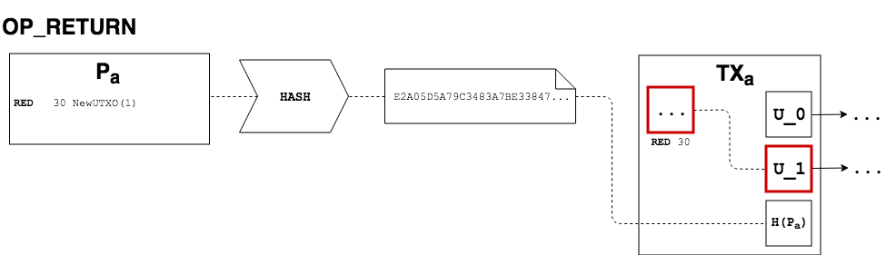
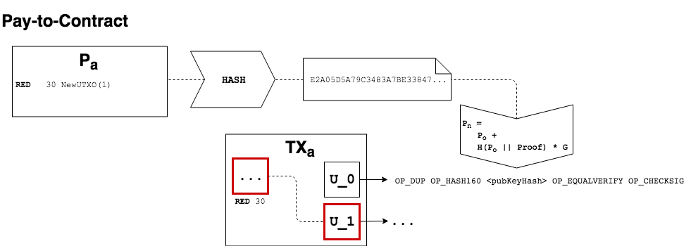

# RGB Protocol Specification #01: Contracts and Proofs

* [Commitment Scheme](#commitment-scheme)
  * [OP_RETURN](#op_return)
  * [Pay-to-contract](#pay-to-contract)
* [Contracts](#contracts)
  * [Re-issuance](#re-issuance)
  * [Proof-of-burn](#proof-of-burn)
  * [Entity Structure](#entity-structure)
    * [Header](#header)
  * [Blueprints and versioning](#blueprints-and-versioning)
    * [Simple issuance: `0x01`](#simple-issuance-0x01)
    * [Crowdsale: `0x02`](#crowdsale-0x02)
    * [Re-issuance: `0x03`](#re-issuance-0x03)
* [Proofs](#proofs)
  * [Transfer proofs](#transfer-proofs)
  * [Special proofs](#special-proofs)
* [Structure](#structure)
  * [Address-Based vs UTXO-Based](#address-based-vs-utxo-based)
  * [RgbOutPoint](#rgboutpoint)
* [Exemplified Process Description](#exemplified-process-description)
  * [Basic Asset Issuance](#basic-asset-issuance)
  * [On-chain Asset Transfer](#on-chain-asset-transfer)
  * [Color Addition](#color-addition)

## Commitment Scheme

In order to ensure immutability and prevent double spend, it's necessary to strongly bind Bitcoin transactions to contracts and proofs, in a way that makes it impossible to modify RGB entities at a later time without invalidating the underlying transaction.

In this specification we describe two commitment schemes available in the RGB protocol, both with some useful features and drawbacks. It's up to the issuer to choose which commitment scheme suits its needs the best, by setting the `commitment_scheme` flag in the contract.

Every contract MUST be deployed using the `OP_RETURN` scheme, independently from which `commitment_scheme` is set.

Every later proof MUST follow the scheme chosen in the contract.

### OP_RETURN

A transaction committing to a proof or contract using the `OP_RETURN` scheme is considered valid if:

1. There's at least one `OP_RETURN` output
2. The first `OP_RETURN` output contains a 32-bytes push which is the `Double_SHA256` of the entity which the transaction is committing to.



### Pay-to-contract

The commitment to a proof made using pay-to-contract is considered valid if:

* Given `n = fee_satoshi mod num_outputs`
* Given `h = double_sha256(proof)`

1. The `n`th output pays an arbitrary amount of Bitcoin to a `P2WPKH` or a `P2PKH` (`P2PK` is considered insecure and not supported)
2. The public key of this output is tweaked using the method described below and the tweak parameter is `h`



#### Public key tweaking

The tweaking procedure has been previously described in many publications, such as [Eternity Wall's "sign-to-contract" article](https://blog.eternitywall.com/2018/04/13/sign-to-contract/).

1. Serialize contract/proof with standard bitcoin transaction serialization rules: `s = consensus_serialize(contract/proof)`
1. Prefix it with "RGB" and compute double hash `h = double_sha256('RGB' || s)`
2. Compute `new_pub_key = original_pubkey + double_sha256('RGB' || original_pubkey || h) * G`
3. Compute the address as a standard Bitcoin `P2(W)PKH` using `new_pub_key` as public key

In order to be able to spend the output later, the same procedure should be applied to the private key.

We are adding additional string "RGB" to the private & public key tweak procedure in order to avoid conflicts with other implementations using Pay-to-contract scheme, Taproot/MAST. Without it, one might make an attack by constructing some RGB contract which will serialize into a meaningful Bitcoin-script-like code to present it as a non-RGB contract. 

In order to make the serialized contract and proofs code unambiguous the proof or contract code must be also prefixed with "RGB" before their hashing.

You can find more information on this matters in the discussion under issue #61 <https://github.com/rgb-org/spec/issues/61>.

## Contracts

Contracts are entities that, once "deployed" on the Bitcoin blockchain, determine the creation of a new, unique asset with a specific set of characteristics (like total supply, divisibility, dust limit, etc.) and possibly provably linked to some kind of commitment by the Issuer.

Every asset is identified by the `asset_id`, which is the hash of some fields of the contracts.

Many different *kinds* (or *blueprints*) of contracts exist, allowing the user to choose the rules that will define how the asset is issued and, later, transferred. **Every contract kind has a specific 1-byte-long unique identifier**, which is serialized and committed to during the deployment phase, to make sure that its behaviour cannot be changed at a later time. Every blueprint also has an independent versioning system, in order to make the entire project even more "modular" (See [issue #23 on GitHub](https://github.com/rgb-org/spec/issues/23)).

### Re-issuance

Since the total supply of an asset is hard-coded into the contract itself, there's no way to change it at a later time. The only way to issue more token, thus inflating the supply, is by doing what's called a **"re-issuance"**, which basically means issuing another contract of type `0x03` (reissuance) linked to the previous one by committing it to `reissuance_utxo`. This feature can be disable by setting `reissuance_enabled` to `0`. 

### Proof-of-burn

Token owners have the ability to *burn* tokens in order to claim or redeem any of the rights associated with their tokens.

To do this, token owner have to send them to the `burn_address`, specified in the contract. The proof showing the transfer should then be published by the asset issuer itself [**extend**] to *prove* that the supply has been deflated.

### Entity Structure

Contracts are ideally made by two parts:

* Header - the area that contains all the fields common among every contract kind
* Body - the area that contains blueprint-specific fields

#### Header

The header contains the following fields:

* `title`: Title of the asset contract
* `description`: Description of the asset contract
* `contract_url`: Unique url for the publication of the contract and the light-anchors
* `issuance_utxo`: The UTXO which will be spent in a transaction containing a  commitment to this contract to "deploy" it
* `network`: The Bitcoin network in use (mainnet, testnet)
* `total_supply`: Total supply in satoshi (1e-8)
* `min_amount`: Minimum amount of tokens that can be transferred together, like a *dust limit*
* `max_hops`: Maximum number of "hops" before the reissuance (can be set to `0xFFFFFFFF` to disable this feature)
* `reissuance_enabled`: Whether the re-issuance feature is enabled or not
* `reissuance_utxo`: (optional) UTXO which have to be spent to reissue tokens
* `burn_address`: The address to send tokens to in order to burn them
* `commitment_scheme`: The commitment scheme used by this contract
* `version`: 16-bit number representing version of the blueprint used

### Blueprints and versioning

#### Simple issuance: `0x01`

**Version `0x0008`**

This blueprint allows to mint `total_supply` tokens and immediately send them to `owner_utxo`.

The additional fields in the body are:

* `owner_utxo`: the UTXO which will receive all the tokens

#### Crowdsale: `0x02`

**Version `0x0008`**

This blueprint allows to set-up a crowdsale, to sell tokens at a specified price up to the `total_supply`. This contract actually creates two different assets with different `assets_id`s. Together with the "normal" token, a new "change" token is issued, to "refund" users who either send some Bitcoins too early or too late and will miss out on the crowdsale. Change tokens have a fixed 1-to-1-satoshi rate in the issuing phase, and are intended to maintain the same rate in the redeeming phase.

The additional fields in the body are:

* `deposit_address`: the address to send Bitcoins to in order to buy tokens
* `price_sat`: the price in satoshi for a single token
* `from_block`: when the crowdsale starts
* `to_block`: when the crowdsale ends

#### Re-issuance: `0x03`

**Version `0x0008`**

This blueprint allows an asset issuer to re-issue tokens by inflating the supply. This is allowed only if the original contract had `reissuance_enabled` != `0`. 

This contract MUST be issued using the `reissuance_utxo` and its version MUST match the original contract's one. 

The following fields in its header MUST be set to `0` in order to disable them:

* `title`
* `description`
* `network`
* `min_amount`
* `max_hops`
* `burn_address`
* `commitment_scheme`

The following fields MUST be filled with "real" values:

* `contract_url`: Unique url for the publication of the contract and the light-anchors
* `issuance_utxo`: The UTXO which will be spent in a transaction containing a  commitment to this contract to "deploy" it (must match the original contract's `reissuance_utxo`)
* `total_supply`: Additional supply in satoshi (1e-8)
* `reissuance_enabled`: Whether the re-issuance feature is enabled or not
* `reissuance_utxo`: (optional) UTXO which have to be spent to reissue tokens
* `version`: 16-bit number representing version of the blueprint used

There are no additional fields in its body.

## Proofs

Proofs, as the name implies, are entities that *prove* that some requirements are met. Proofs allow transfer of assets by proving the ownership of them and "connect" to contracts, by fulfilling all the conditions set in the contract itself.

Like contracts, proofs have an header and a body, where the common and "special" fields are stored respectively.

### Transfer proofs

Every RGB on-chain transaction will have a corresponding **"proof"**, where the payer encrypts, using the payee’s dark-tag, the following information in a structured way:

* the entire chain of proofs received up to the issuance contract;
* a list of triplets made with:
	* color of the token being transacted
	* amount being transacted
	* either the hash of an UTXO in the form (TX_hash, index) to send an *UTXO-Based* transaction or an index which will bind those tokens to the corresponding output of the transaction *spending* the colored UTXO.
* an optional free field to pass over transaction meta-data that could be conditionally used by the asset contract to manipulate the transaction meaning (generally for the "meta-script" contract blueprint);

In order to help a safe and easy management of the additional data required by this feature, the dark-tag can be derived from the BIP32 derivation key that the payee is using to generate the receiving address.

**[note on safety of mixing Bitcoin and RGB addresses]**

This feature should enhance the anonymity set of asset users, making chain analysis techniques almost as difficult as ones on “plain bitcoin” transactions. The leakage of a specific transaction dark-tag gives away the path from the issuing to the transaction itself, and of the “sibling” transactions, but it preserves uncertainty about other branches.

### Special proofs

Every contract blueprint needs a special "adaptor" proofs, that *proves* that the payer can fulfill the requirements specified by the contract itself.

## Structure

### Address-Based vs UTXO-Based

RGB allows the sender of a colored transaction to transfer the ownership of any asset in two slightly different ways:

* **UTXO-Based** if the receiver already owns one ore more UTXO(s) and would like to "bind" its new tokens he is about to receive to this/those UTXO(s). This allows the sender to spend the nominal Bitcoin value of the UTXO which was previously bound to the tokens however he wants (send them back to himself, make an on-chain payment, open a Lightning channel or more). The UTXO is serialized as `SHA256D(TX_HASH || OUTPUT_INDEX_AS_U32)` in order to increase the privacy of the receiver.
* **Address-Based** if the receiver prefers to receive the colored UTXO itself;

### RgbOutPoint

`RgbOutPoint` is an entity that encodes the receiver of some tokens. It can either be a `Sha256d` entity when used in an UTXO-based transaction, to represent the double SHA256 of the pair (TX_HASH, OUTPUT_INDEX), or a 16-bit unsigned integer when used in an address-based transaction.

When serialized, one more byte is added to encode which of the two branches is being encoded. Its value must be `0x01` for UTXO-based transactions and `0x02` for address-based ones.

For example, the byte sequence:

```
01 49CAFDBC 3E9133A7 5B411A3A 6D705DCA 2E9565B6 60123B65 35BABB75 67C28F02
```

is decoded as:

* `0x01` = UTXO-based transaction
* `...` = SHA256D(TX_HASH || OUTPUT_INDEX_AS_U32)

## Exemplified Process Description
The following Process Description assumes:

* one-2-one transfers after the issuance (many-to-many transfers are possible);
* single-asset issuance and transfers (multi-asset issuance and transfers are possible);
### Basic Asset Issuance

1. The issuer prepares the public contract for the asset issuing, with the following structure:

```c
{
	"kind": 0x01 // The kind of contract we are creating, in this case a generic issuance
	"version": 0x0008 // Version of this contract kind to use,
	"title": <String>, // Title of the asset contract
	"description": <String>, // Description of possible redeeming actions and non-script conditions
	"issuance_utxo": <String>, // The UTXO which will be spent with a commitment to this contract,
	"contract_url": <String>, // Unique url for the publication of the contract and the light-anchors
	"total_supply": <Integer>, // Total supply in satoshi (1e-8)
	"max_hops": <Integer>, // Maximum amount of onchain transfers that can be performed on the asset before reissuance
	"min_amount": <Integer>, // Minimum amount of colored satoshis that can be transferred together,
	"network": "BITCOIN", // The network in use
	"reissuance_enabled": 0, // Disable reissuance
	"burn_address": <Address>, // The address used to burn tokens
	"commitment_scheme": "OP_RETURN", // The commitment scheme used by this asset
	

	"owner_utxo": <String>, // The UTXO which will receive all the issued token. This is a contract-specific field.
}
```

2. The issuer spends the `issuance_utxo` with a commitment to this contract (using an `OP_RETURN`) and publishes the contract. *`total_supply`* tokens will be created and sent to `owner_utxo`.

### On-chain Asset Transfer
1. The payee can either chose one of its UTXO or generates in his wallet a receiving address as per BIP32 standard, together with 30 bytes of entropy, which will serve as dark-tag for this transfer.
2. The payee transmits the UTXO or the address, the dark-tag and a list of storage servers he wishes to use to the payer.
3. The payer composes (eventually performing a coin-selection process from several unspent colored outputs), signs and broadcasts with his wallet a transaction with the following structure (the order of inputs and output is irrelevant):
  * Inputs
     * Colored Input 1: valid colored (entirely or partially) UTXO to spend
     * Colored Input 2: (optional)
  * Outputs
     * Colored Output 1: address of the Nth receiver (if performing an *Address-Based* transaction)
     * Colored Output 2: (optional) another address of the payer for the colored (up to capacity) and non-colored change

The payer also produces a new transfer proof containing:

* A list of triplets made with:
	* color of the token being transacted;
	* amount being transacted;
	* either the hash of an UTXO in the form `SHA256D(TX_HASH || OUTPUT_INDEX_AS_U32)` to send an *UTXO-Based* tx or the index of the output sent to the receiver to send an *Address-Based* tx;
* Optional meta-script-related meta-data;

The proof is hashed and a commitment to the hash is included in the transaction, in this case using an `OP_RETURN`.

This proof is also symmetrically encrypted with the dark-tag using AES 256 together with the entire chain of proofs up to the issuance of the token and uploaded to the storage server(s) selected by the payee.

### Color Addition
[expand]
