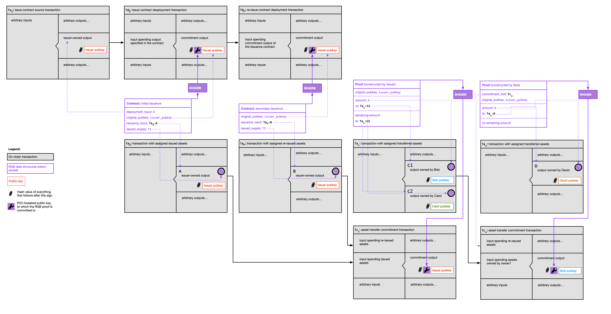

# RGB Protocol Specification #01: Contracts and Proofs

* [Overview](#overview)
  * [Versioning](#versioning)
* [Commitment Scheme](#commitment-scheme)
  * [Pay-to-contract](#pay-to-contract)
    * [Public key tweaking](#public-key-tweaking)
  * [OP_RETURN](#op_return)
* [Contracts](#contracts)
  * [Entity Structure](#entity-structure)
    * [Header](#header)
  * [Blueprint types](#blueprint-types)
    * [Initial issuance](#initial-issuance)
    * [Secondary issuance](#secondary-issuance)
    * [Asset version upgrades](#upgrade)
    * [Proofs history pruning](#pruning)
    * [Crowdsale issuance](#crowdsale)
* [Proofs](#proofs)
  * [Transfer proofs](#transfer-proofs)
  * [Asset assignments](#asset-assignments)
  * [Multi-signature Asset Ownership](#multi-signature-asset-ownership)
  * [Asset proof of burn](#proof-of-burn)
  * [Version update specifics](#version-update-specifics)

## Overview

The protocol allows initial and secondary issuance, upgrades, transfers of digital assets (tokenised securities, collectionables etc) on top of LNP/BP technology stack. The assets are issued and re-issued using different types (called **blueprints**) of **RGB contracts** and are transferred using **RGB proofs**.

In order to prevent double-spends, the protocol utilizes single-use-seals mechanism, originally proposed by Peter Todd. Briefly, contracts and proofs **[assign](#asset-assignments)** some defined amounts of assets to bitcoin transaction outputs, named **assigned assets** and **outputs with assigned assets** correspondingly. Each time an output with assigned assets is spent it implies the fact of the asset transfer, and a corresponding new proof for the asset transfer has to be created. To reach immutability, both contracts and proofs cryptographically commit their data into Bitcoin transaction outputs; these outputs are called **committed outputs** (see [Commitment Scheme](#commitment-scheme) section). For an initial asset issuance, contracts commit to a transaction spending some predefined bitcoin transaction outpoint; for secondary asset issuance — to the transaction spending committed output of the most recent issuance contract (see [Contract](#contracts) section for details). For asset transfer proofs, commitment outputs MUST BE placed into the transactions spending outputs with assigned assets, but the transferred assets can be assigned to some other external transactions, if required. Alongside asset assignments, each proof references hashes (unique identifiers) of its **parent** proofs and contracts, indicating the sources of the transferred assets (see [Proofs](#proofs) section for details).

### Versioning

The protocol can be updated in the future, affecting the structure of the entities which are used by it (contracts, proofs). In order to preserve the space used by those entities, we use strict serialization format which does not allow adding/removing fields or changing types of existing fields. Thus, each entity has its own version as its first field, which defines how the entity has to be parsed. 

The version is a 16-bit integer, constructed of two main parts: major and minor version bits. The minor version is the lower (in little-endian Bitcoin encoding format) six bits (0-63); the major version is the upper ten bits. Minor version represents backward-compatible protocol changes ("soft-forks"), while major version increase represents incompatible changes ("hard-forks"). 

Proofs MAY have different minor version than the issuing contract, however they can't differ in a major version from it. This is required in order to prevent potential double-spending: the changes in a commitment schemes are "hard-forks" without backward compatibility, and they will require increase of the major version. Since the proofs can't have a different major version than the issuing contract, it will be impossible to produce two proofs under the different commitment schemes utilizing incompatible versions.

If the issuer would like to upgrade the contract major version, he needs to deploy a new [upgrade contract](#upgrade)  with the updated major version, so asset owners will be able to upgrade and migrate to a new version through it. 

A special attention must be paid to the major upgrades changing the existing commitment schemes. Please check [proof version upgrade specifics](#version-update-specifics) section for the details.

Contract major and minor version jointly defines the set of available contract blueprints and their structure.

The current specification defines the structure for the 0.5 version of RGB contracts, their blueprints and transfer proofs. 

## Commitment Scheme

In order to ensure immutability and prevent double spend, it's necessary to strongly bind RGB contracts and asset transfer proofs to Bitcoin transaction outputs in a way that makes impossible to modify RGB entities at a later time without invalidating them. This is done with cryptographic commitments, that commit the hash of the contract or proof into the mined bitcoin transaction output – pretty much like it is done in the [OpenTimeStamps](https://opentimestamps.org/).

In this specification we describe two commitment schemes available in the RGB protocol: Pay-to-contract and OP_RETURN. Pay-to-contract scheme SHOULD BE the default recommended scheme, while OP_RETURN SHOULD BE be reserved only for asset transfer proofs that have to be compatible with hardware wallets, thus proofs under the same contract can use different commitment schemes. Contracts always MUST BE deployed only with pay to contract scheme. Proofs 

The reason of pay-to-contract being the default scheme is the reduction of Bitcoin blockchain pollution with asset transfer data and better privacy: pay-to-contract has higher protection from on-chain analysis tools.

Contracts and proofs assign RGB assets to transaction(s) output(s) (see `issuance_txout` field in [contract header](#header) and `assignments` field in the [proof structure](#proofs) for the details). These transaction(s) MAY differ from a transaction the contract or the proof is committed to. In order to prevent a double spend, each time when a UTXO containing an RGB asset is spent, the spending transaction MUST contain new commitment to the proof of the asset spending. Proofs that are not committed to a transaction which spends **all** of the UTXOs corresponding to RGB assets given in the proof parents – or committed to some other transaction – MUST BE considered invalid.

Which commitment scheme is used by a contract or a proof is defined by the presence of the `original_pk` field in their header.

### Pay-to-contract

The commitment to a proof made using pay-to-contract SHOULD BE considered valid if, and only if:

* Given `n = fee_satoshi mod num_outputs`

1. The `n`th output pays an arbitrary amount of Bitcoin to `P2PKH`, `P2WPKH` or `P2SH`-wrapped `P2WPKH`.
2. The public key of this output is tweaked using the method described below
3. There are no `OP_RETURN` outputs in the same transaction (this rune is [forced at the level of Bitcoin Core](https://github.com/bitcoin/bitcoin/blob/d0f81a96d9c158a9226dc946bdd61d48c4d42959/src/policy/policy.cpp#L131))

Otherwise, the proof MUST BE considered as an invalid and MUST NOT BE accepted; the assets associated with the parent proofs MUST BE considered as lost. NB: since in the future (with the introduction of the future SegWit versions, like Taproot, MAST etc) the list of supported output types MAY change, assets allocated to invalid outputs MUST NOT BE considered as deterministically burned; in order to create a proper proof of burn user MUST follow the procedure described in the [Proof-of-burn section](#proof-of-burn)

Rationale for not supporting other types of transaction outputs for the proof commitments:
* `P2PK`: considered legacy and MUST NOT be used;
* `P2WSH`: the present version of RGB specification does not provides a way to deterministically define which of the public keys are present inside the script and which are used for the commitment – however, this behaviour may change in the future (see the note above);
* `P2SH`, except `P2SH`-wrapped `P2WPKH`, but not `P2SH`-wrapped `P2WSH`: the same reason as for `P2WSH`;
* `OP_RETURN` outputs can't be tweaked, since they do not contain a public key and serve pre-defined purposes only. If it is necessary to commit to OP_RETURN output one should instead use [OP_RETURN commitment scheme](#op_return)
* Non-standard outputs: tweak procedure can't be standardized.

#### Public key tweaking

The tweaking procedure has been previously described in many publications, such as [Eternity Wall's "sign-to-contract" article](https://blog.eternitywall.com/2018/04/13/sign-to-contract/). However, since the tweaking is already widely used practice ([OpenTimeStamps](https://petertodd.org/2016/opentimestamps-announcement), [merchant payments](https://arxiv.org/abs/1212.3257)) and will be even more adopted with the intruduction of [Taproot](https://lists.linuxfoundation.org/pipermail/bitcoin-dev/2018-January/015614.html), [Graphroot](https://lists.linuxfoundation.org/pipermail/bitcoin-dev/2018-February/015700.html), [MAST](https://github.com/bitcoin/bips/blob/master/bip-0114.mediawiki) and many other proposals, the hash, used for public key tweaking under one standard (like this one) can be provided to some uninformed third-party as a commitment under the other standard (like Taproot), and there is non-zero chance of a collision, when serialized RGB contract or proof will present at least a partially-valid Bitcoin script or other code that can be interpreted as a custom non-RGB script and used to attack that third-party. In order to reduce the risk, we follow the practice introduced in the [Taproot BIP proposal](https://github.com/sipa/bips/blob/bip-schnorr/bip-taproot.mediawiki#tagged-hashes) of prefixing the serialized RGB contract/proof with **two** hashes of RGB-specific tags, namely "rgb:contract" for contracts and "rgb:proof" for proofs. Two hashes are required to further reduce risk of undesirable collisions, since nowhere in the Bitcoin protocol the input of SHA256 starts with two (non-double) SHA256 hashes.

The whole algorithm thus looks in the following way
1. Serialize contract/proof with standard bitcoin transaction serialization rules `s = consensus_serialize(<contract> -or- <proof>)` and compute its hash, i.e. obtain `contract_id`/`proof_id` value: `id = SHA256(s)`
1. Prefix it twice with a hash of a proper tag and compute double hash with `hash`tag`(m)` function introduced in the [Taproot BIP](https://github.com/sipa/bips/blob/bip-schnorr/bip-taproot.mediawiki#tagged-hashes) `h = hash`rgb:contract/rgb:proof`(original_pubkey || id)`, where `hash`tag`(message) := SHA256(SHA256(tag) || SHA256(tag) || message)`
2. Compute `new_pubkey = original_pubkey + h * G`
3. Compute the address as a standard Bitcoin `P2(W)PKH` using `new_pubkey` as public key

In order to be able to spend the output later, the same procedure should be applied to the private key.

### OP_RETURN

This scheme MUST BE used only to commit the proofs created with a special hardware (digital wallets) which is unable to support signing of pay-to-contract output commitments. 

A transaction committing to a proof or contract using the `OP_RETURN` scheme is considered valid if:

1. There's at least one `OP_RETURN` output
2. The first `OP_RETURN` output contains a 32-bytes push which is SHA256 of the entity which the transaction is committing to (i.e. `contract_id` and `proof_id`, which reperesent SHA256 of serialized contract/proof data), prefixed with `rgb:contract` (for contracts) and `rgb:proof` (for proofs) UTF-8 strings: `OP_RETURN <SHA256('rgb:<contract|proof>' || SHA256(serialized_bytecode))`

## Contracts

Contracts are entities that, once "deployed" on the Bitcoin blockchain, determine the creation of a new, unique asset with a specific set of characteristics (like total supply, divisibility, dust limit, etc.) and possibly provably linked to some kind of commitment by the Issuer.

Contract is uniquely identified by its `contract_id`, which is computed as a single SHA245-hash of the serialized commitment fields from both contract header and body.

Many different *kinds* (or **blueprints**) of contracts exist, allowing the user to choose the rules that will define how the asset is issued and, later, transferred. Every contract kind has a specific 1-byte-long unique identifier for the used blueprint type (`blueprint_type` field), which is serialized and committed to during the deployment phase, to make sure that its behaviour cannot be changed at a later time.

### Entity Structure

Contracts are made of two parts:

* Header - the area that contains all the fields common among every contract kind
* Body - the area that contains blueprint-specific fields

Both header and body contain fields to which the contract is cryptographically committed ("commitment fields") – and fields that do not participate in the generation of the cryptographic commitment. The latter can be either permanent or prunable; the permanent fields are required for the contract verification process and need to be transferred to other peers. Prunable fields are computable fields, they serve utility function, optimising the speed of data retrieval from Bitcoin Core node. Prunable fields are optional, they MAY be transferred upon request from one peer to other (alike witness data in bitcoin blocks), however peers are MAY NOT keep these data and can decline the requests for providing them from other peers.

#### Header

The header contains the following fields:

* Commitment fields:
    * `version`: [version](#versioning) of the contract, 16-bit integer.
    * `blueprint_type`: 16-bit number representing version of the blueprint used
    * `title`: title of the asset contract
    * `description`: (optional) description of the asset contract
    * `contract_url`: (optional) unique url for the publication of the contract and the light-anchors
    * `network`: Bitcoin network in use (mainnet, testnet)
    * `issued_supply`: total issued supply, using the smallest indivisible available unit, 64-bit unsigned integer
    * `max_supply`: (optional) puts a limit to the total amount of assets that may be issued by subsequent inflation contracts. For contracts with absent `inflation_txout` this field MUST BE omitted. For other cases, the absence of the field implies no upper cap to the asset inflation.
    * `dust_limit`: minimum amount of assets that can be transferred together, like a *dust limit* in Lightning Network, 64-bit unsigned integer
    * `issuance_txout`: [RgbOutPoint](#asset-assignments) which will held the issued assets
    * `inflation_txout`: (optional) [RgbOutPoint](#asset-assignments) which has to be spent in order to deploy a contract increasing issued asset supply (see [secondary issuance](#secondary-issuance)). Absence of the field means that additional issuance is not enabled.
    * `upgrade_txout`: (optional) [RgbOutPoint](#asset-assignments) which has to be spent in order to deploy an asset upgrade contract (see [upgrade contract](#upgrade) for the details). If the value is absent, then it defaults to the output committing to the contract deployment.
    * `pruning_txout`: [RgbOutPoint](#asset-assignments) which has to be spent in order to deploy a contract pruning the proofs history (see [pruning contract](#pruning) for the details).
    * `deployment_txout`: UTXO which will be spent in the transaction which will have a contract commitment
    * `signature`: (optional) signature of the committed part of the contract (without the signature field itself).
* Non-prunable non-commitment fields:
    * `original_pubkey`: provides the original public key before the tweak procedure which is needed to verify the contract commitment. Original public key is not a part of the commitment fields since it was explicitly included into the commitment during pay-to-contract public key tweaking procedure.

NB: Since with bitcoin network protocol-style serialization, used by RGB, we can't have optionals, the optional header fields should be serialized as a zero-length strings, which upon deserialization must be converted into `nil/NULL`

The contract issuer MAY sign the contract (by filling the appropriate `signature` field). It is the right of the issuer to choose which key should be used for contract signing: it can be the same key which is used for an associated commitment output, a key associated with the DNS certificate of the issuer domain, or any other.

### Blueprint types

These blueprints cover basic contracts for fungible assets. New blueprint types can be added later; addition of new blueprint types will require the increase of minor version of the deployment contract.

#### Initial issuance

This blueprint allows to mint `issued_supply` tokens and immediately send them to `issuance_txout`.

The `blueprint_type` for initial issuance is `0x01`. There are no additional fields in its body.

#### Secondary issuance

Since the total supply of an asset is hard-coded into the contract itself, there's no way to change it at a later time. The only way to issue more token, thus inflating the supply, is by doing what's called a **secondary issuance**, which basically means issuing another contract of type `0x02` linked to the previous one by committing it to the `inflation_utxo`. This feature can be disable by setting `inflation_utxo` to `0`. 

This contract MUST be deployed by spending the commitment output of the original issuing contract. The major version of the inflation contract MUST match the original contract's one. 

The following fields in its header MUST be set to `0` or zero-length string in order to disable the (i.e. their values will be inherited from the original issuance contract):

* `title`
* `description`
* `network`
* `min_amount`
* `deployment_txout`

The following fields MUST be filled:

* `contract_url`: Unique url for the publication of the contract and the light-anchors
* `issued_supply`: Additional supply in satoshi (1e-8)
* `inflation_txout`: (optional) [RgbOutPoint](#asset-assignments) which has to be spent in order to deploy a contract increasing issued asset supply (additional issuance). Absence of the field means that additional issuance is not enabled.
* `migration_txout`: (optional) [RgbOutPoint](#asset-assignments) which has to be spent in order to deploy an asset migration contract. If the value is absent, then it defaults to the output committing to the contract deployment.
* `blueprint_type`: 16-bit number representing version of the blueprint used (i.e. `0x03`)

The `blueprint_type` for initial issuance is `0x02`. There are no additional fields in its body.

#### Upgrade

This allows to update the major contract version in order to migrate the assets to the new backward-incompatible proof formats (i.e. changing the major version number, see [Versioning](#versioning) for details). Deployment of this contract by the party controlling `upgrade_txout` from the original issuance contract signifies the network that the issuer has accepted the security risks associated with the upgrade to the new major proofs version and recommends the upgrade to all asset owners.

NB: While it might not be required to utilize single use seal procedure requiring some additional input to be added to some bitcoin transaction, at the present time we have not come with some other secure option for the upgrade procedure. This can be a matter of the research efforts for the future.

The following fields in the contract header MUST BE set to `0` or zero-length string in order to disable them (i.e. their values will be inherited from the original issuance contract):

* `title`
* `description`
* `contract_url`
* `network`
* `dust_limit`
* `deployment_txout`
* `issued_supply`
* `max_supply`
* `inflation_txout`

The contract MUST define a new value for the `upgrade_txout` and `pruning_txout` 

The `blueprint_type` for the upgrade contract is `0x03`.

#### Pruning

When the proof's history becomes to large, the issuer (more precisely, the party controlling `pruning_txout` from the initial, secondary issuance and upgrade contracts) MAY deploy the pruning contract into the transaction spending `pruning_txout` field of the previous issuance/upgrade/pruning contract, plus all inputs for the assets which proofs history has to be pruned.

The following fields in the contract header MUST BE set to `0` or zero-length string in order to disable them (i.e. their values will be inherited from the original issuance contract):

* `title`
* `description`
* `contract_url`
* `network`
* `dust_limit`
* `deployment_txout`
* `issued_supply`
* `max_supply`
* `inflation_txout`
* `upgrade_txout`

The contract MUST define a new value for the `issuance_txout` and `pruning_txout` fields. fields. The `` will define where the new (prunned) history for the proofs must be started.

The `blueprint_type` for the upgrade contract is `0x03`.

The issuer MUST keep the complete history of the proofs before the pruning and MUST provide it to all interested clients upon their request.

#### Crowdsale

This blueprint allows to set-up a crowdsale, to sell tokens at a specified price up to the `issued_supply`. This contract actually creates two different assets with different `assets_id`s. Together with the "normal" token, a new "change" token is issued, to "refund" users who either send some Bitcoins too early or too late and will miss out on the crowdsale. Change tokens have a fixed 1-to-1-satoshi rate in the issuing phase, and are intended to maintain the same rate in the redeeming phase.

The additional fields in the body are:

* `deposit_address`: the address to send Bitcoins to in order to buy tokens
* `price_sat`: the price (in satoshis) for a single token
* `from_block`: when the crowdsale starts
* `to_block`: when the crowdsale ends

These fields are commitment fields.

The `blueprint_type` for the upgrade contract is `0x10`.

## Proofs

Proofs, as the name implies, are entities that *prove* that some requirements are met. Proofs allow transfer of assets by proving the ownership of them and "connect" to contracts, by fulfilling all the conditions set in the contract itself.

Like contracts, proofs have an header and a body, where the common and "special" fields are stored respectively.

Both header and body contain fields to which the contract is cryptographically committed ("commitment fields") – and fields that do not participate in the generation of the cryptographic commitment. The latter can be either permanent or prunable; the permanent fields are required for the contract verification process and need to be transferred to other peers. Prunable fields are computable fields, they serve utility function, optimising the speed of data retrieval from Bitcoin Core node. Prunable fields are optional, they MAY be transferred upon request from one peer to other (alike witness data in bitcoin blocks), however peers are MAY NOT keep these data and can decline the requests for providing them from other peers.

Proof is uniquely identified by its `proof_id`, which is computed as a single SHA245-hash of the serialized commitment fields.

### Transfer proofs

Every RGB on-chain transaction will have a corresponding **proof**, where the payer stores the following information in a structured way:

* Commitment fields:
    * `version`: [version](#versioning) of the proof, 16-bit integer.
    * `assignments`: an array, where elements are subarrays containing list of transfers for each of the assets. Assets are ordered according to their order in the parent proofs and contracts. For instance, if the first parent proof transacts assets C and then B, the second A and B, then the order of asset subarrays will be "C, B, A". Each subarray for a given asset contains:
        * amount being transacted
        * [RgbOutPoint](#asset-assignments) for the asset: a UTXO for *UTXO-Based* transfers – or an index which will assign the asset to the corresponding output of the transaction *spending* the input UTXO.
    * `metadata`: an optional free field to pass over transaction meta-data that could be conditionally used by the asset contract to manipulate the transaction meaning (generally for the "meta-script" contract blueprint);
* Non-commitment non-prunable fields:
    * `original_pubkey`: (optional) If present, signifies P2C commitment scheme and provides the original public key before the tweak procedure which is needed to verify the proof commitment. Original pubkey is not a part of the commitment fields since it was explicitly included into the commitment during pay-to-contract public key tweaking procedure.
* Prunable fields:
    * `parents`: a list containing parent `proof_id`s (and/or `contract_id`s when the proof spends issuing output of some contract, upgrades to the new contract version or prunes previous proof history);
    * `commitment_txid`: transaction this proof is committed to. This is required field for the proofs assigning assets to a yet-unspent outputs (i.e. proofs with no downstream proofs). For historical proofs this is a redundant information, since asset spending transaction is the transaction containing the proof commitment. However, this information can be still kept in order to increase the speed of requests to Bitcoin Core.

Notes on output structure:
* Zero length for the list of outputs is used to indicate [proof of burn](#proof-of-burn)
* The amount field in the last transfer tuple for each asset type MUST BE omitted and MUST BE automatically deduced as `sum(assets_amounts_in_txins) - sum(assigned_amounts)` for the given asset type. This allows do avoid situations where `sum(assets_amounts_in_txins) > sum(assigned_amounts)` and  saves storage space.

The proof MUST be considered invalid as a whole if `sum(assets_amounts_in_txins) < sum(assigned_amounts)` for any of the assets transferred by the proof.

### Asset assignments

RGB allows the sender of a commitment transaction to transfer the ownership of any asset in two slightly different ways:

* **UTXO-Based** if the receiver already owns one ore more UTXO(s) and would like to assign the asset he is about to receive to this/those UTXO(s). This allows the sender to spend the nominal Bitcoin value of the UTXO which was previously bound to the tokens however he wants (send them back to himself, make an on-chain payment, open a Lightning channel or more). The UTXO is serialized as `SHA256D(TX_HASH || OUTPUT_INDEX_AS_U32)` in order to increase the privacy of the receiver.
* **Address-Based** if the receiver prefers to receive the colored UTXO itself;

`RgbOutPoint` is an entity that encodes the receiver of some assets. It can either be bitcoin `OutPoint` entity when used in an UTXO-based transaction, to represent the pair (TX_HASH, OUTPUT_INDEX), or a 16-bit unsigned integer when used in an address-based transaction.

When serialized, one more byte is added to encode which of the two branches is being encoded. Its value must be `0x01` for UTXO-based transactions and `0x02` for address-based ones.

### Version update specifics

The proofs MUST stick to the highest major version provided by the parent proofs (proofs which associated assets are spent). If the issuers of some of the assets under the proof have not adopted (according to the [algotithm](#upgrade)) the highest major version which is adopted by the other assets from the proof, these assets MUST be transferred by a separate proof.

A special attention must be paid to the major upgrades changing the existing commitment schemes. These updates, in order to address the associated risk of double-spent attack, MUST follow very specific procedure:
1. The asset issuer must announce that he supports the update by committing to an appropriate [upgrade contract](#upgrade).
2. All the asset owners which would like to upgrade the asset will be publishing the first proof with the updated major version. This proof MUST use and MUST BE validated with the commitment scheme rules from the *previous* version.
3. All the following proof after this first proof adapting the new major version MUST adapt and MUST BE validated with the new commitment scheme as defined by the new version specification.
4. There is no possibility to downgrade the major version of the proofs that has adopted a commitment scheme upgrade.

### Multi-signature asset ownership

Multi-signature asset ownership is working in the same way it works for bitcoin: transfer proofs MAY assign RGB assets to a `P2SH` or `P2WSH` address containing multi-signature locking script, while being committed with either Pay-to-contract or OP_RETURN commitment scheme to some other output within the same or other transaction.

Such assets can be spent with a new transfer proof only under the same circumstances as satoshis under this output: if the unlocking script will satisfy the signing conditions of the locking script.

### Proof-of-burn

Token owners have the ability to *burn* tokens in order to claim or redeem any of the rights associated with their tokens.

To do this, token owner have to issue a special form of the proof ("proof of burn"), having zero assignments, and commit it with either Pay-to-contract or OR_RETURN scheme. The proof SHOULD then be published by the asset issuer itself to prove that the supply has been deflated.
