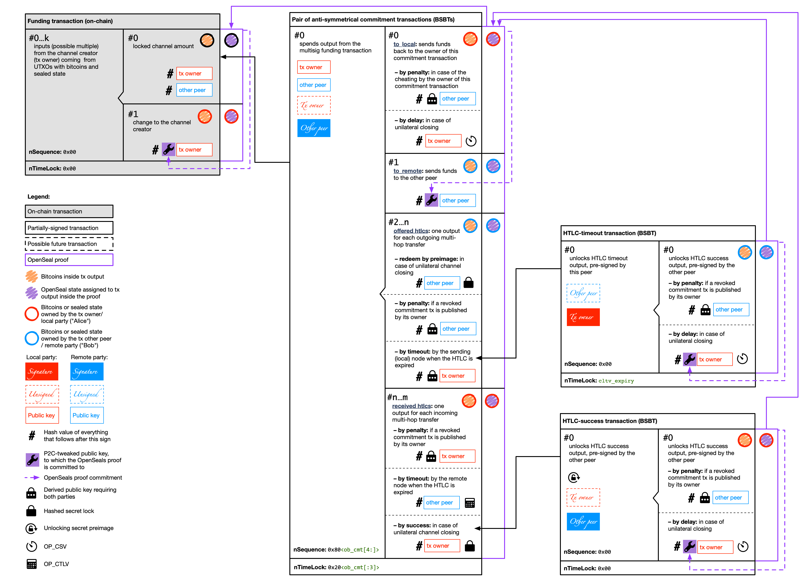

# OpenSeals over Lightning Network

This document describes how Lightning Network is able to support client-validated state utilizing single-use seals with 
a very little number of changes. We will refer mostly to the implementation-agnostic `lightning-rfc` and, occasionally, 
to particular implementations when it is unavoidable to reference non-standard features.

## Spectrum differences to RGB

1. Root proofs MUST NOT be deployed within LN channels; normal OpenSeals protocol MUST be used for this purpose.
2. Due to a [rigid LN transaction structure](#design-rationale), OP_RETURN commitments can't be used with Lightning 
   Network. This, however, does not limit OpenSeals functionality: `OP_RETURN` commitments SHOULD BE used in OpenSeals 
   only when hardware wallets are used to sign transactions containing proof commitment; at the same time Lightning 
   Network requires "hot" storage of the private keys, so this feature is unnecessary.
3. Sealing state to UTXOs outside of the transaction with proof commitment is strictly prohibited in order to prevent
   double-spend type of attacks; all proofs sealing at least one of their outputs to an UTXO outside of Lightning 
   Network channel funding, commitment and HTLC transactions MUST BE considered invalid, but only within the given 
   Lightning channel scope. This requirement does not limit protocol functionality, since sealing UTXOs outside of
   the transaction committing to a proof is used to save blockchain space and reduce the size of transactions, which 
   is not required for partially signed transactions withing a state channel.
4. While it is possible to construct OpenSeals channels without sufficient bitcoin liquidity and use them only for state
   management, it is recommended to open OpenSeals channels alongside normal LN channels with good liquidity in order to 
   enable paying fees for state routing over multi-hop Lightning paths.
5. A new data type `state_id` for identifying a state managed by proof's DAG is introduced. The state originates from
   a *root proof*. This identifier is required for informing Lightning Network nodes which particular state histories
   are put by OpenSeals node into the payment channels. See [state identifiers](#state-identifiers) for more details.

## State identifiers

Every state originating from some *root proof* is identified by a `state_id`, which is computed in the following way:  
`state_id = RIPMD160(SHA256(root_proof_id || txid_with_proof_commitment || state_index_within_root_proof))`,  
where `txid_with_proof_commitment` is a serialized txid (in standard bitcoin serialization format) of the transaction in 
which this contract is committed to and `state_index_within_root_proof` is an index of the `state_type` withing 
`proof_type` state list for the given schema. Use of RIPMD160 hash gives smaller size for the `state_id`, which is 
important for saving storage space in proofs, and makes `state_id` indistinguishable from Bitcoin addresses.

The rational for this `state_id` design is the following: OpenSeals-enabled LN nodes would have to announce the list of 
state graphs (i.e. state ids) they can support. Since we'd like to increase the privacy, we need these state ids to be
"obscured", i.e. not easily tracked down to the specific root proof – unless for those who has the source of the 
root proof. This means that we could not just rely on `SHA256(root_proof_id || index)`, since root_proof_id is 
frequently public, and it will be quite easy to construct "rainbow tables" with `root_proof_id`s joined by different 
indexes and track the state ids announced by some node down to the root proofs. At the same time, 
`txid_with_proof_commitment` is a private information known only to owners of the root proof source data (with the 
exception of public root proofs, but we do not need to hide `state_id`s for public data anyway).

## Transaction structure modification

### Design rationale

1. P2WSH outputs within the commitment and funding transactions MUST NOT be used for P2C commitments (and they are not 
   supported by the current OpenSeals protocol version). This implies that the transaction fee MUST BE set up in such 
   a way that it will point to the correct transaction output containing pay-to-contract commitment to the proof.
2. LN transactions have very rigid structure: we can't modify the number of inputs and outputs withing commitment and 
   HTLC-timeout/success transactions, so we are limited to P2C public/private tweaks. This is due to the fact that the 
   actual transactions are not transferred via wire LN protocol, but rather reconstructed by each node according to 
   the deterministic algorithm according to [BOLT-3](https://github.com/lightningnetwork/lightning-rfc/blob/master/03-transactions.md), 
   and only signatures for these transactions are passed to the other peer. Changing transaction structure (number and 
   order of inputs or outputs) will invalidate such signatures and will break interoperability between normal and 
   OpenSeals-enabled LN nodes.
3. Commitment and HTLC transactions can be tweaked at a fixed points since each of them has only a single P2WPKH output 
   (#1 for the commitment and #0 for the HTLC transactions).
4. Bitcoins and multiple OpenSeal states can be easily combined withing the same channel, opening a route for such 
   applications as decentralized markets exchanging tokenized goods or securities, or DEXes (exchange in asset/bitcoin 
   pairs along multi-hop routes).
5. Since OpenSeals state is sealed to outputs withing LN channel tx structure, they will "follow" bitcoins from that 
   outputs, meaning that we get all complex LN channel security behaviors for cooperative/unilateral/non-cooperative 
   channel closing, channel updates and multi-hop transfers with HTLCs for "free"...
6. ... and we just need to make sure that with each channel operation, when a new partially-signed bitcoin transaction 
   (PSBT) is being generated, we create a proper OpenSeal proof for it and commit to it by tweaking a public key in 
   that single P2WPKH output presented in each type of LN channel PSBT.

### Transaction details

## Wire protocol modifications

### Feature bits

We picked bits `10/11` of the [`features`](https://github.com/lightningnetwork/lightning-rfc/blob/master/09-features.md) 
bit-array to signal for OpenSeals support. We plan to use mostly the tenth bit (so that the node will still be able to 
connect to "vanilla" ones), but reserving the even bit too allows to, if a node admin wants to, connect exclusively to 
OpenSeals-compatible nodes.

Also, in order to function properly, OpenSeals will require to have bits `8/9` (support for TLVs) set by both parties 
involved into channel creation.

### General design

1. We reuse the existing messages as much as possible, to ensure compatibility with non-OpenSeal nodes. These messages 
are extended utilizing new [TLV-encoded](https://github.com/lightningnetwork/lightning-rfc/blob/master/01-messaging.md#type-length-value-format) 
[extra message part](https://github.com/lightningnetwork/lightning-rfc/pull/630). Since TLV extensions are not yet 
incorporated into all message types, we need to track the progress of this feature development and communicate with 
Lightning RFC team explaining requirements of the Spectrum protocol in this regard. This process has started here:
<https://github.com/lightningnetwork/lightning-rfc/pull/630#issuecomment-521998839>

2. When creating a new message type is necessary to replace a "vanilla" one, the same `type` + a constant format is used.

### Changes to specific messages:

#### `init`
Announcement of feature flags plus set of OpenSeals [state identifiers](#state-identifiers) that can be included into 
the channel.

#### `open_channel`
Since this message is the first step toward creating the funding transaction and both versions of the commitment 
transaction, we need to announce the other party following information, required for constructing proper transactions:
* Array consisting of pairs of `state_id` and corresponding state data which will be included into the channel
* Proof history confirming the ownership of the state (PROBLEM: how to transfer large proof history that does not fit 
  into the message? May be we can provide a link to the service from which the history can be accessed?)

#### `accept_channel`
The same data as provided by the `open_channel`, except the proof history, to confirm the acceptance of the channel.

#### `update_add_htlc`
* Array consisting of pairs of `state_id` and associated state for the state changes that has to be added to the channel 
  for either routed payments or direct settlement.

#### `revoke_and_ack`
[todo]

## Workflows

[todo]
