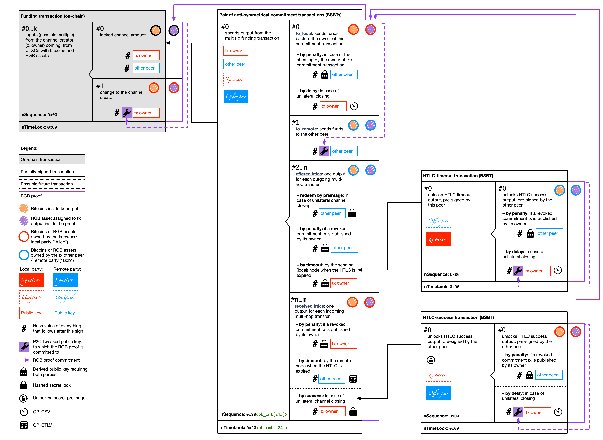

# RGB Protocol Specification #04: Lightning Network Integration (Spectrum)

This document describes how Lightning Network is able to support RGB with a very  little number of changes. We will refer mostly to the implementation-agnostic `lightning-rfc` and, occasionally, to particular implementations when it is unavoidable to reference non-standard features.

## Spectrum differences to RGB

1. Asset issuing contracts MUST NOT be deployed within Spectrum channels; normal RGB protocol MUST be used for this purpose.

2. Due to a [rigid LN transaction structure](#design-rationale), OP_RETURN commitments can't be used with Spectrum. This does not limit Spectrum functionality: `OP_RETURN` commitments SHOULD BE used in RGB only with hardware wallets and HSM modules; Lightning network requires "hot" storage of the private keys, so this feature is unnecessary.

3. UTXO-binding of the RGB assets is strictly prohibited in Spectrum due to security reasons, and all proofs spending at lease one of its outputs to an existing UTXO MUST BE considered invalid within the Spectrum channel. This requirement does not limit protocol functionality, since in the original RGB bindings to existing UTXOs are used to save blockchain space and reduce the size of transactions, which is not required for partially signed transactions withing state channel – and the size of the on-chain channel funding transactions does not change.

4. While it is possible to construct Spectrum channels without sufficient bitcoin liquidity and use them only for asset transfers, it is recommended to open Spectrum channels alongside normal LN channels with good liquidity in order to enable asset exchanging, which is a nice monetization opportunity for Spectrum node holders.

## Transaction structure modification

### Design rationale

1. P2WSH outputs within the commitment and funding transactions MUST NOT be used for P2C commitments (and they are not supported by the current RGB protocol version). This implies that the transaction fee MUST BE set up in a such way that it will point into the correct transaction output containing pay-to-contract commitment to the proof.

2. LN transactions have very rigid structure: we can't modify the number of inputs and outputs withing commitment and HTLC-timeout/success transactions, so we are limited to pay-to-contract public/private tweaks committing RGB proofs. This is due to the fact that the actual transactions are not transferred via wire LN protocol, but rather reconstructed by each node according to the deterministic algorithm according to [BOLT-3](https://github.com/lightningnetwork/lightning-rfc/blob/master/03-transactions.md), and only signatures for these transactions are passed to the other peer. Changing transaction structure (number and order of inputs or outputs) will invalidate such signatures and will break interoperability between normal and Spectrum-enabled LN nodes.

3. Commitment and HTLC transactions can be tweaked at a fixed points since each of them has only a single P2WPKH output (#1 for the commitment and #0 for the HTLC transactions).

4. Bitcoins and RGB (multi)assets can be easily combined withing the same channel, opening a route for DEX functionality (exchange in asset/bitcoin pairs on the multi-hop route)

5. Since RGB assets are bound to outputs withing LN channel tx structure, they will "follow" the bitcoins from that outputs, meaning that we get all complex LN channel security behaviors for cooperative/unilateral/non-cooperative channel closing, channel updates and multi-hop transfers with HTLCs for "free"...

6. ... and we just need to make sure that with each channel operation, when a new partially-signed bitcoin transaction (PSBT) is being generated, we create a proper RGB proof for it and committing to it by tweaking the pk in that single P2WPKH output presented in each type of LN channel PSBT

### Transaction details

## Wire protocol modifications

### Feature bits

We picked bits `10/11` of the [`features`](https://github.com/lightningnetwork/lightning-rfc/blob/master/09-features.md) bit-array to signal for Spectrum support. We plan to use mostly the tenth bit (so that the node will still be able to connect to "vanilla" ones), but reserving the even bit too allows to, if a node admin wants to, connect exclusively to Spectrum-compatible nodes.

Also, in order to function properly, Spectrum will require to have bits `8/9` (support for TLVs) set by both parties involved into channel creation.

### General design

1. We reuse the existing messages as much as possible, to ensure compatibility with non-Spectrum nodes. These messagess are extended utilizing new [TLV-encoded](https://github.com/lightningnetwork/lightning-rfc/blob/master/01-messaging.md#type-length-value-format) [extra message part](https://github.com/lightningnetwork/lightning-rfc/pull/630). Since TLV extensions are not yet incorporated into all message types, we need to track the progress of this feature development and communicate with Lightning RFC team explaining requirements of the Spectrum protocol in this regard.

2. When creating a new message type is necessary to replace a "vanilla" one, the same `type` + a constant format is used.

### Changes to specific messages:

#### `init`
Announcement of feature flags plus set of assets that can be included into the channel

#### `open_channel`
Since this message is the first step toward creating the funding transaction and both versions of the commitment transaction, we need to announce the other party following information, required for constructing proper transactions:
* Array consisting of pairs of `asset_id` and `amount` which will be included into the channel
* Proof history confirming the ownership of the asset (PROBLEM: how to transfer large proof history that does not fit into the message? May be we can provide a link to the service from which the history can be accessed?)

#### `accept_channel`
The same data as provided by the `open_channel`, except the proof history, to confirm the acceptance of the channel

#### `update_add_htlc`
* Array consisting of pairs of `asset_id` and `amount` for the balances that has to be added to the channel state for either routed payments or direct settlement.

### Extra considerations

* Since the `short_channel_id` cannot be changed, we plan to treat each "colored" channel as multiple virtual channels running on top of a "physical" channel (which, has a precise `short_channel_id`). Signaling of the additional colors is challenging: being compatible with the current [`channel_announcement` message](https://github.com/lightningnetwork/lightning-rfc/blob/master/07-routing-gossip.md#the-channel_announcement-message) is a huge plus, but there's very little space to pack extra information into it. Our best bet right now, is to reserve another odd feature bit, to signal that additional info are coded into the feature bits themselves, and then use the variable-length space to encode the list of `asset_id`s running on that channel.
* Signaling fees is also pretty challenging: the [`channel_update` message](https://github.com/lightningnetwork/lightning-rfc/blob/master/07-routing-gossip.md#the-channel_update-message) has *no* variable length field, so encoding the `asset_id` is very hard. Fortunately, since in the case of colored channels we want to spread the exchange rate against bitcoin instead of a "fee" amount, we can recover 4 bytes from the `fee_base_msat` field.

## Workflows

[todo]
